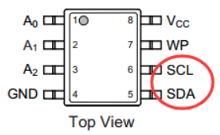
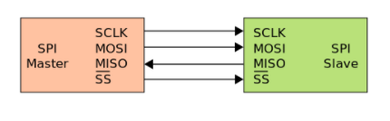

# SPI, I2C通信

I2C通信协议最常用于EEPROM(如Atmel的AT24CXX系列)

通信需要用到两个引脚：SDA SCL。**SCL是时钟引脚，SDA是数据引脚**

如下EEPROM芯片：

SPI通信需要3个或4个引脚：下面几个名字在不同场商可能各不相同但是意思一样

- SCLK: Serial Clock (output from master) 时钟信号
- MOSI: Master Out Slave In (data output from master) 主机输出，从机输入
- MISO: Master In Slave Out (data output from slave) 主机输入，从机输出
- CS /SS: Chip/Slave Select (often [active low](https://en.wikipedia.org/wiki/Logic_level), output from master to indicate that data is being sent)  片选

## 参考

+ [理解一下单片机的I2C和SPI通信-电子工程世界 (eeworld.com.cn)](http://news.eeworld.com.cn/mcu/ic488780.html)
+ [Serial Peripheral Interface - Wikipedia
+ [[SPI通信协议详解（spi总线） - 知乎 (zhihu.com)](https://zhuanlan.zhihu.com/p/150121520)](https://en.wikipedia.org/wiki/Serial_Peripheral_Interface)

