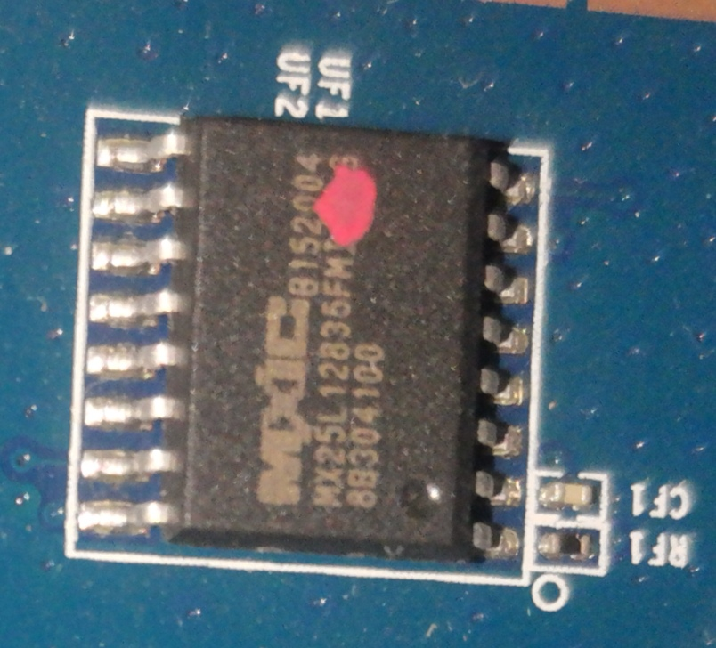
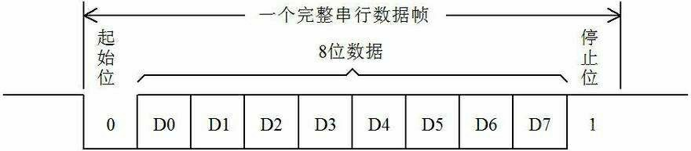
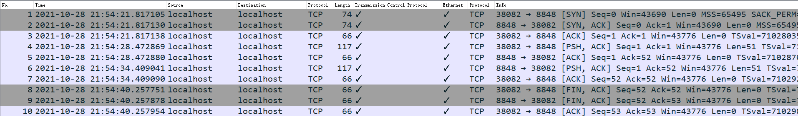
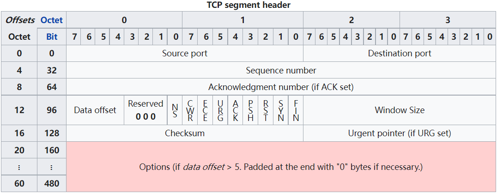
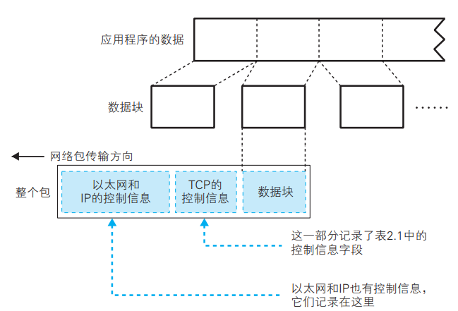
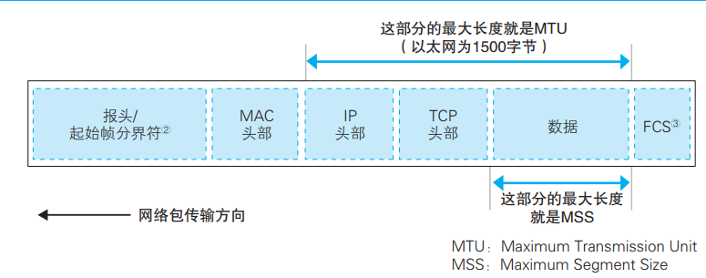
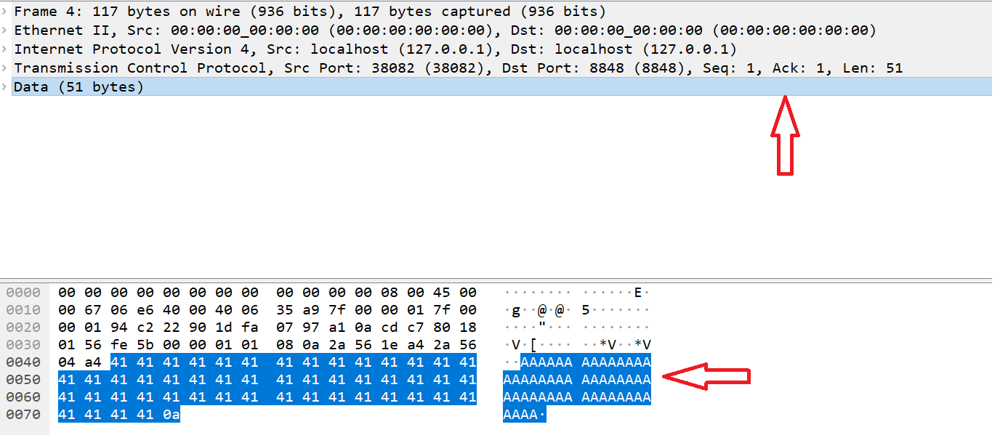
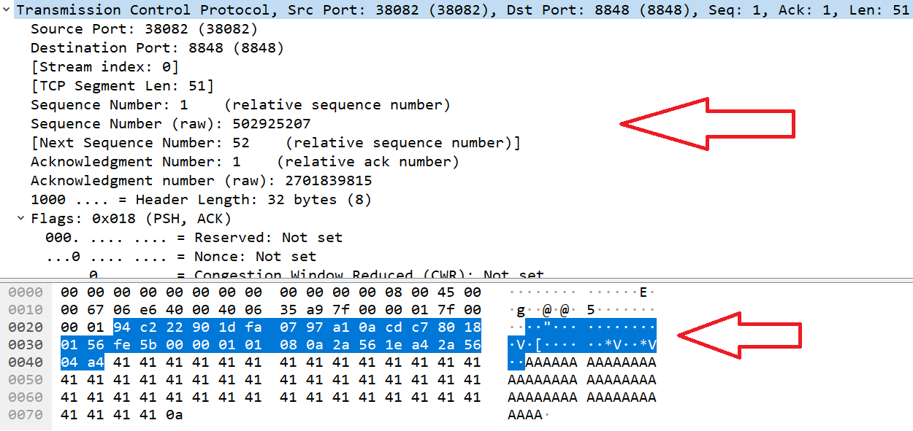
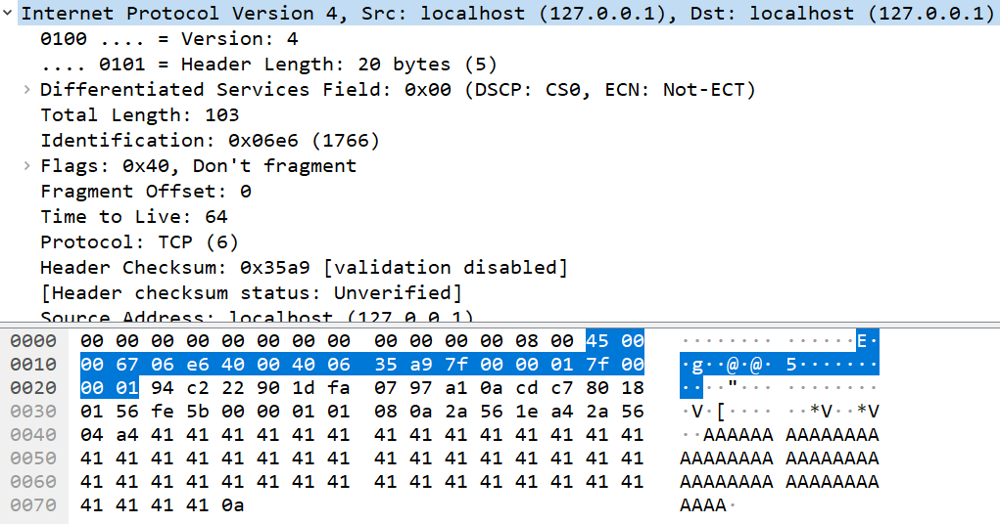
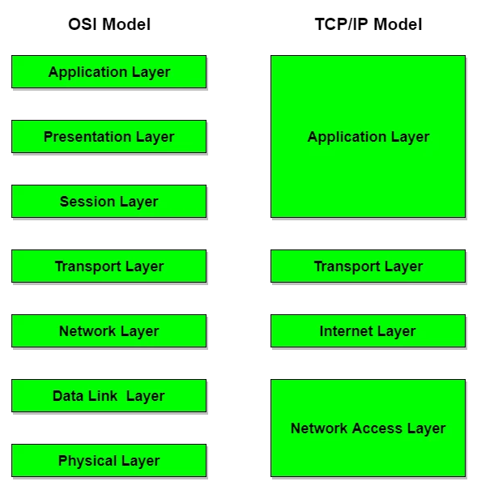

# 路由器组成

## 硬件

+ CPU：
  + QualCom 高通，BraodCom博通， MediaTek联发科， RealTek瑞昱
+ RAM：
  + SDRAM，DDR， DDR2， DDR3
+ ROM(Flash)：**存放bootloader，固件等**
  + SPI Flash， NOR Flash， NAND Flash
+ WIFI芯片：
  + USB总线，PCI-E总线


### ROM芯片

ROM 是只读存储器（Read-Only Memory）的简称，需要用专门的软件才能进行擦除。有**ROM、PROM、EPROM、EEPROM、FLASH-ROM**

目前大部分IOT设备采用**FLASH-ROM**即FLASH，这又包括**SPI NorFlash 、CFI Flash、Parallel NandFlash、SPI NandFlash、eMMC Flash**。

+ `SPINorFlash(NorFlash)`：使用的引脚少，易于连接，操作方便，并且可以在芯片上直接运行代码，市场占有率很高。一般容量较小32M，稳定
  + 型号：S25FL128、MX25L1605、W25Q64等

> NOR Flash和普通的内存比较像的一点是他们都可以支持随机访问，这使它也具有支持XIP（eXecute In Place）的特性，可以像普通ROM一样执行程序。这点让它成为BIOS等开机就要执行的代码的绝佳载体。

+ ParallelNandFlash(NandFlash)：很擅于存储纯资料或数据等，在**嵌入式系统中用来支持文件系统**
  + 大部分的U盘都是使用NandFlash
  + 容量较大128M，但坏块较多不稳定
+ eMMCFlash：主要是针对手机或平板电脑



如上图MX25L128：

+ MX：场商缩写
+ 25L：型号，一般25，24开头
+ 128Mbits：16MB

从TTL信息也可以验证：

> This is a Serial Flash
> Boot partition size = 262144(0x40000)
> Found an ST compatible serial flash with 256 64KB blocks; total size 16MB


### 通信协议

串口通信指串口按位（bit）发送和接收字节。尽管比按字节（byte）的并行通信慢，但是串口可以在使用一根线发送数据的同时用另一根线接收数据。在串口通信中，常用的协议包括 RS-232、 RS-422 和RS-485。




## 软件

+ bootloader：
  + CFE：Common Firmware Environment
  + Uboot：Univer Boot Loader
+ 固件：
  + 开源系统：OperWrt， Tomato， DD-WRT
  + 闭源系统：
    + 芯片厂商系统：高通QSDK，LSDK。联发科ECOS
    + 第三方系统：
      + VxWorks系统：TP-Link
      + 基于Unix系统(linux, BSD)发开
      + 基于开源系统修改


## 网络协议

下面以一个TCP/IP 三次握手和四次挥手为例


Server: 等待client连接并接收"AAAAA...."后发送"BBBBB...."

```bash
amd64@ubuntu:~$ nc -vvl 8848
Listening on [0.0.0.0] (family 0, port 8848)
Connection from [127.0.0.1] port 8848 [tcp/*] accepted (family 2, sport 38082)
AAAAAAAAAAAAAAAAAAAAAAAAAAAAAAAAAAAAAAAAAAAAAAAAAA
BBBBBBBBBBBBBBBBBBBBBBBBBBBBBBBBBBBBBBBBBBBBBBBBBB
```


Send: 连接Server 并发送"AAAAA....." 接收Server的"BBBBB....."

```bash
amd64@ubuntu:~$ nc 127.0.0.1 8848
AAAAAAAAAAAAAAAAAAAAAAAAAAAAAAAAAAAAAAAAAAAAAAAAAA
BBBBBBBBBBBBBBBBBBBBBBBBBBBBBBBBBBBBBBBBBBBBBBBBBB
```


使用tcpdump进行抓包：

```bash
sudo tcpdump -i lo -s0  -w ./tmp.pcap
```

WireShark析包：



+ 可以看到前面三个包进行了三次握手：用于同步
  + 同步两者的序号(seq) 和 窗口大小
+ 中间几次发包：数据传输
+ 最后四次挥手：断开连接


### TCP header



从低到高依次为：

+ 发送方端口：16bits
+ 接收方端口：16bits
+ 发送数据的顺序编号：32bits
+ 接收数据的顺序编号：32bits
+ 数据偏移：4bits
  + 数据部分(data)在包中的偏移，可以认为是头部大小
+ 保留位：3bits
+ flags：9bits
  + SYN，FIN等
+ 窗口大小：16bits
  + 接收方通知发送方自己的窗口大小(缓冲区空闲size)
+ 校验和：16bits
+ 紧急指针：16bits
+ 可选字段

**所以一个TCP 头至少20bytes**


### 包的发送与接收

包含程序数据的包：



以太网中一个网络包的最大长度一般为1500bytes(**MTU**)

MSS：**除去头部**之后一个网络包所能包容的TCP数据的最大长度



如上例子中：

数据包：



TCP 头：OSI中对应传输层，主要负责通信双方应用程序的数据流，建立连接、发送数据以及断开连接



IP头部：OSI中对应网络层，包含ip地址主要负责路由




以太网头部：OSI中对应链路层，包含mac地址


最后通过物理层：将整个数据包以比特流形式发送，也会有对应的协议

